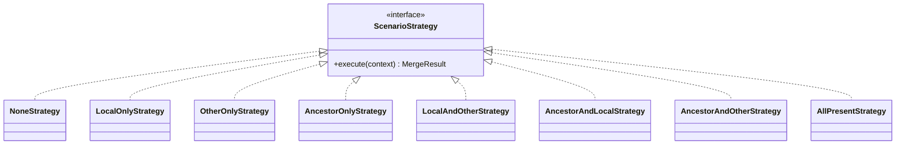
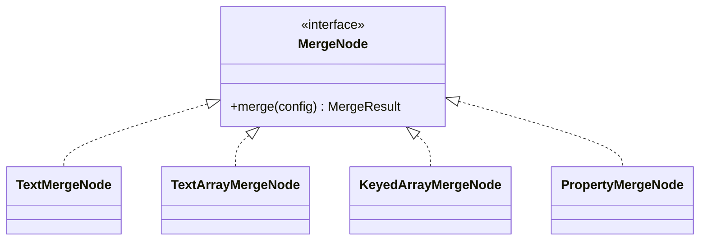
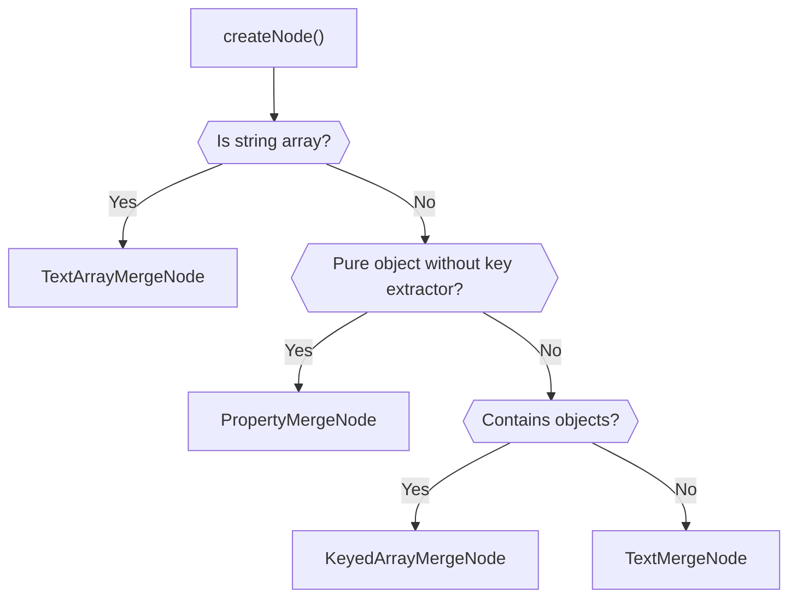
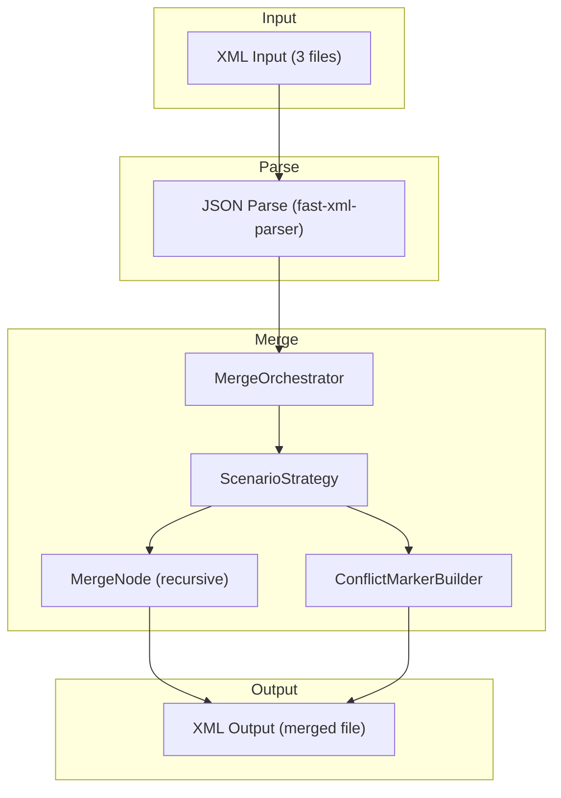
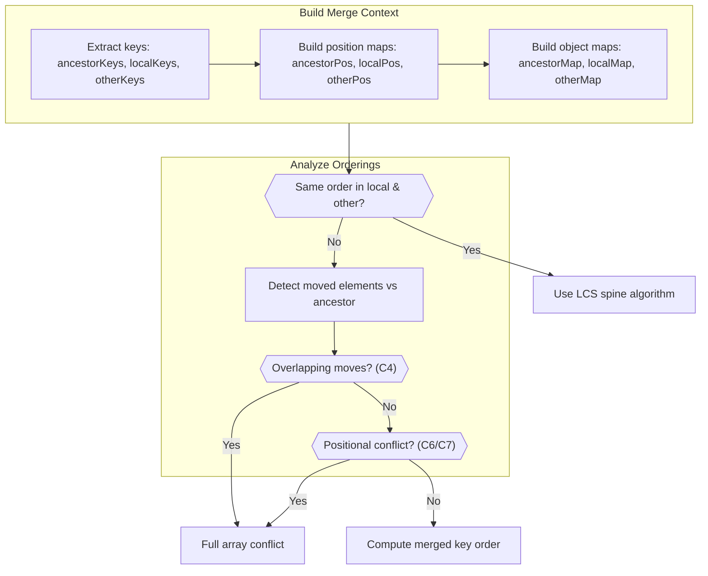
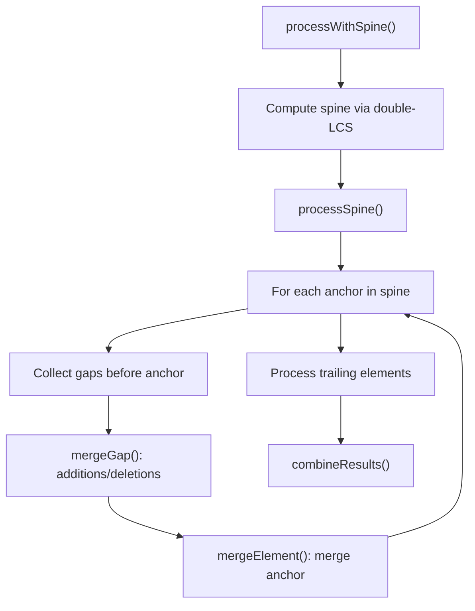

# Architecture Design Document

This document describes the software architecture of the Salesforce Git Merge Driver.

## Overview

The merge driver implements a three-way merge algorithm specifically designed for Salesforce metadata XML files. It parses XML into JSON, performs intelligent merging based on metadata structure, and outputs the merged result back to XML.

## Design Patterns

### Strategy Pattern

The merge logic uses the **Strategy Pattern** to handle different merge scenarios. Each scenario (based on which versions have content) has its own strategy implementation.



**Strategies:**
- `NoneStrategy` - No content in any source
- `LocalOnlyStrategy` - Only local has content
- `OtherOnlyStrategy` - Only other has content
- `AncestorOnlyStrategy` - Only ancestor has content (deleted in both)
- `LocalAndOtherStrategy` - Both added (no ancestor)
- `AncestorAndLocalStrategy` - Other deleted
- `AncestorAndOtherStrategy` - Local deleted
- `AllPresentStrategy` - Full three-way merge

### Composite Pattern

The merge nodes implement the **Composite Pattern** to handle different data structures uniformly.



**Node Types:**
- `TextMergeNode` - Handles scalar/primitive values
- `TextArrayMergeNode` - Handles arrays of primitive values (e.g., `members` in package.xml)
- `KeyedArrayMergeNode` - Handles arrays of objects with key fields (e.g., `fieldPermissions` with `field` key)
- `PropertyMergeNode` - Handles pure objects without key extractor (property-by-property merge)

### Factory Pattern

The `MergeNodeFactory` creates the appropriate node type based on the data structure:



Implementation: [MergeNodeFactory.ts](src/merger/nodes/MergeNodeFactory.ts)

## Core Components

### MergeOrchestrator

The central coordinator that:
1. Determines the merge scenario using `MergeScenarioFactory`
2. Applies early termination optimization when all inputs are equal
3. Selects the appropriate strategy via `ScenarioStrategyFactory`
4. Builds the `MergeContext` and executes the strategy

```typescript
class MergeOrchestrator {
  merge(ancestor, local, other, attribute?, rootKey?): MergeResult
}
```

### MergeContext

Immutable context object passed to strategies:

```typescript
interface MergeContext {
  readonly config: MergeConfig
  readonly ancestor: JsonValue
  readonly local: JsonValue
  readonly other: JsonValue
  readonly attribute: string | undefined
  readonly nodeFactory: MergeNodeFactory
  readonly rootKey: RootKeyInfo | undefined
}
```

### MergeScenario

Enum representing the 8 possible scenarios based on content presence:

| Scenario | Ancestor | Local | Other | Value |
|----------|----------|-------|-------|-------|
| NONE | - | - | - | 0 |
| OTHER_ONLY | - | - | ✓ | 1 |
| LOCAL_ONLY | - | ✓ | - | 10 |
| LOCAL_AND_OTHER | - | ✓ | ✓ | 11 |
| ANCESTOR_ONLY | ✓ | - | - | 100 |
| ANCESTOR_AND_OTHER | ✓ | - | ✓ | 101 |
| ANCESTOR_AND_LOCAL | ✓ | ✓ | - | 110 |
| ALL | ✓ | ✓ | ✓ | 111 |

### Conflict Handling

When conflicts cannot be auto-resolved, the driver generates zdiff3-style conflict markers:

```xml
<<<<<<< ours
    <field>localValue</field>
||||||| base
    <field>originalValue</field>
=======
    <field>remoteValue</field>
>>>>>>> theirs
```

The `ConflictMarkerBuilder` constructs these markers, and `ConflictMarkerFormatter` handles post-processing (entity escaping, indentation correction).

## Data Flow



## Key Design Decisions

### 1. JSON Intermediate Representation

XML is converted to JSON for easier manipulation. The `fast-xml-parser` library preserves:
- Element order
- Attributes (prefixed with `@_`)
- Text content (stored in `#text` property)

### 2. Key-Based Array Merging

Salesforce metadata arrays (like `fieldPermissions`) use semantic keys rather than position-based merging. The driver identifies key fields from metadata configuration to match elements across versions.

### 3. Early Termination Optimization

When all three inputs are deeply equal, the merge returns immediately without traversing the structure. This significantly improves performance for unchanged files.

### 4. Immutable Context

The `MergeContext` is immutable, ensuring strategies cannot accidentally modify shared state.

### 5. Configurable Conflict Markers

Conflict marker size and labels are configurable via Git's standard parameters (`-L`, `-S`, `-X`, `-Y` flags), allowing integration with existing Git workflows.

## Deterministic Ordering Algorithm

For ordered metadata types (e.g., `GlobalValueSet`, `StandardValueSet`), the driver implements a deterministic three-way merge algorithm that preserves element ordering while detecting and merging compatible changes.

### Core Principles

1. **User decides order** — never auto-resolve ambiguous ordering conflicts
2. **Value-based comparison** — elements are compared by their key field, not position
3. **Disjoint change detection** — non-overlapping reorderings can be merged automatically
4. **Conflict on overlap** — when both sides move the same elements differently, conflict
5. **Positional conflict detection** — concurrent additions at different positions trigger conflict

### Algorithm Overview

The `OrderedKeyedArrayMergeStrategy` handles ordered arrays through these steps:



### Moved Element Detection

An element is considered "moved" if its relative order with any other element changed between ancestor and modified version. Uses upper-triangle optimization to avoid redundant pair comparisons:

```typescript
// For each pair (a, b) where a comes before b in ancestor:
// If a comes after b in modified → both a and b are "moved"
for (i = 0; i < ancestorKeys.length; i++) {
  for (j = i + 1; j < ancestorKeys.length; j++) {
    if (modifiedPos[a] > modifiedPos[b]) {
      moved.add(a); moved.add(b)
    }
  }
}
```

### Positional Conflict Detection (C6)

When both sides add the same element but at different relative positions, a conflict is triggered. This is detected by comparing the relative order of added elements against all common elements:

```typescript
// For element added by both sides:
// Check if its position relative to any common element differs
if (addedLocalPos < keyLocalPos !== addedOtherPos < keyOtherPos) {
  return true // Positional conflict
}
```

### Merge Scenarios

| ID | Scenario | Behavior |
|----|----------|----------|
| M1-M9 | Standard merges | Additions, deletions, modifications handled by spine algorithm |
| M10 | Disjoint swaps | Local swaps {A,B}, other swaps {C,D} → merge both |
| C4 | Divergent moves | Both sides move same element differently → conflict |
| C6 | Positional conflict | Both sides add same element at different positions → conflict |
| C7 | Concurrent addition with diverged orderings | Both sides add different elements while orderings diverge → conflict |

### Example: M10 Disjoint Swaps

```
Ancestor: [A, B, C, D]
Local:    [B, A, C, D]  ← swapped A↔B
Other:    [A, B, D, C]  ← swapped C↔D

Analysis:
- localMoved  = {A, B}  (A and B changed relative order)
- otherMoved  = {C, D}  (C and D changed relative order)
- Intersection = ∅      (disjoint changes)

Merge:
- Apply local's order for {A,B}: [B, A]
- Apply other's order for {C,D}: [D, C]
- Result: [B, A, D, C]
```

### Example: C6 Positional Conflict

```
Ancestor: [A, B]
Local:    [A, X, B]     ← added X between A and B
Other:    [X, A, B]     ← added X before A

Analysis:
- X added by both, but at different positions
- In local: X is after A
- In other: X is before A
- Relative order conflict → full array conflict
```

### Example: C7 Concurrent Addition with Diverged Orderings

```
Ancestor: [A, B]
Local:    [B, A, X]     ← swapped A↔B, added X
Other:    [A, B, Y]     ← added Y

Analysis:
- localMoved = {A, B} (swapped)
- Both sides added different elements (X vs Y)
- Ambiguous: should result be [B, A, X, Y] or [B, A, Y, X]?
- Concurrent additions with diverged orderings → full array conflict
```

### Implementation

Key methods in `OrderedKeyedArrayMergeStrategy` ([KeyedArrayMergeNode.ts](src/merger/nodes/KeyedArrayMergeNode.ts)):

| Method | Purpose |
|--------|---------|
| `buildMergeContext()` | Extracts keys and builds position/object maps for O(1) lookups |
| `analyzeOrderings(ctx)` | Returns `{canMerge, localMoved, otherMoved}` |
| `getMovedElements(ctx, modifiedPos)` | Finds elements that changed relative order |
| `hasAddedElementPositionalConflict(ctx)` | Detects C6 scenario (same element added at different positions) |
| `computeMergedKeyOrder(ctx, analysis)` | Builds merged key order; returns null for C7 conflict |
| `processDivergedOrderings(config, ctx, analysis)` | Handles disjoint reorderings |
| `processWithSpine(config, ctx)` | Uses LCS for spine-based merge |
| `processSpine(config, spine, ctx)` | Iterates spine anchors, processes gaps between them |

### Spine-Based Merge Algorithm

The spine-based merge uses the [Longest Common Subsequence (LCS)](https://en.wikipedia.org/wiki/Longest_common_subsequence) algorithm to identify stable anchor points between versions.

#### Spine Computation

The **spine** is the stable backbone of elements present in all versions with preserved relative order:

```typescript
spine = lcs(lcs(ancestor, local), lcs(ancestor, other))
```

Implementation: [KeyedArrayMergeNode.ts:170](src/merger/nodes/KeyedArrayMergeNode.ts#L170)

#### Process Flow



#### Example

```
Ancestor: [A, B, C, D, E]
Local:    [A, X, B, D]      ← deleted C, E; added X
Other:    [A, B, Y, D, E]   ← added Y

spine = [A, B, D]

Gaps processed:
  before B: local adds X
  before D: other adds Y, local deletes C
  trailing: local deletes E

Result: [A, X, B, Y, D]
```

### Applicable Metadata Types

Ordered merging applies to metadata with position-significant arrays:

- `GlobalValueSet` → `customValue` (key: `fullName`)
- `StandardValueSet` → `standardValue` (key: `fullName`)
- `CustomField` → `valueSet.customValue` (key: `fullName`)
- `RecordType` → `picklistValues.values` (key: `fullName`)
