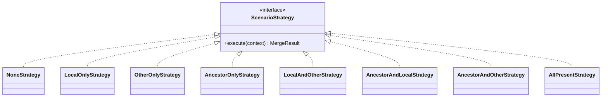
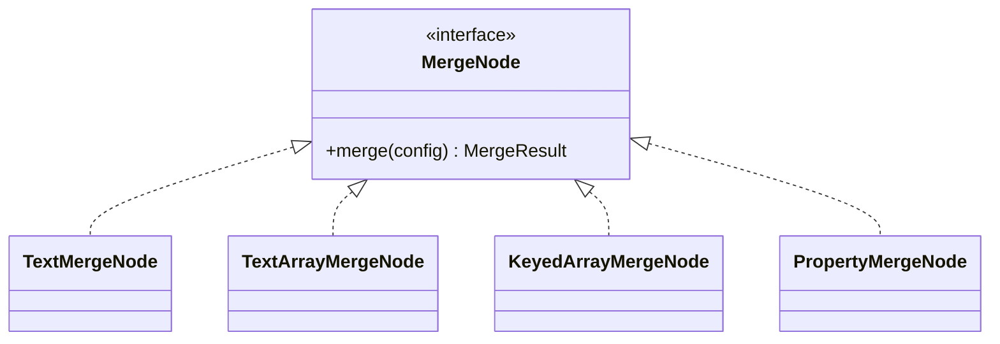
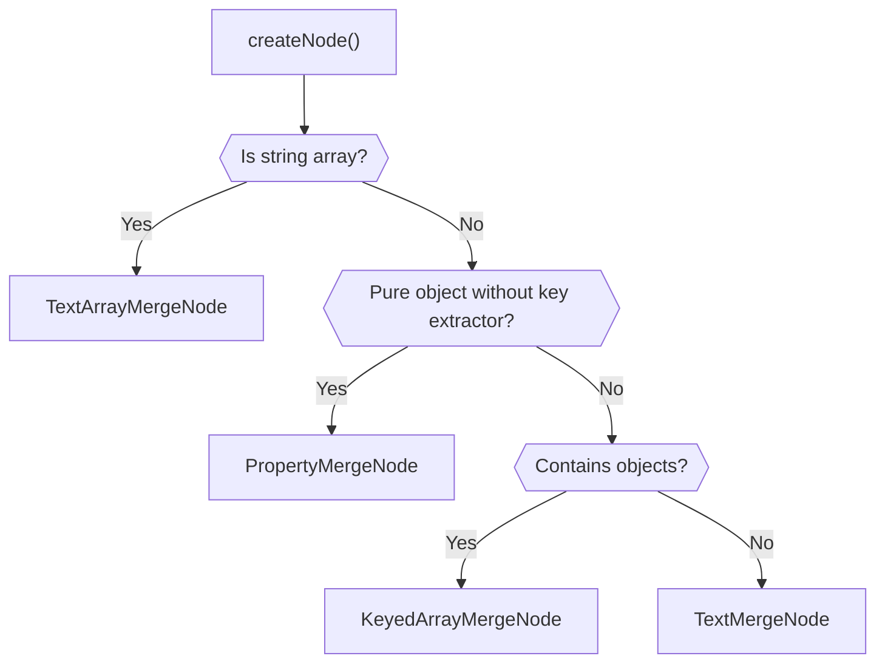
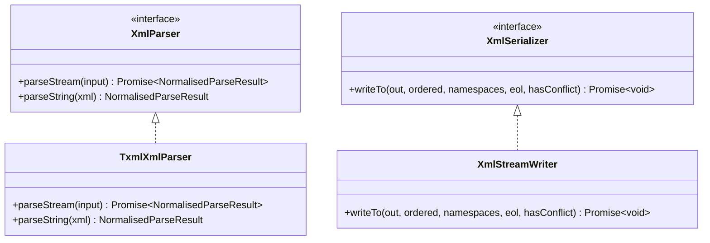
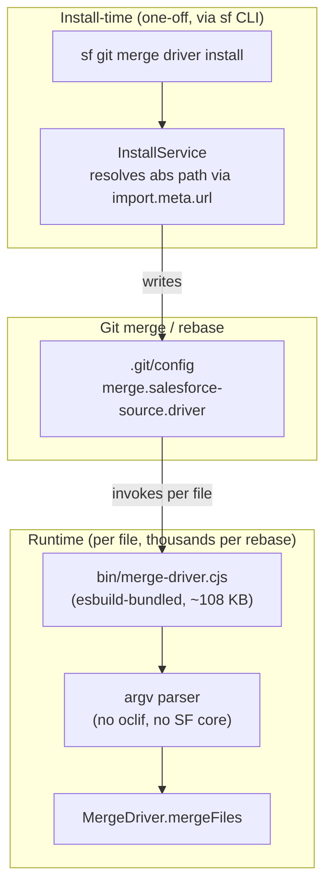
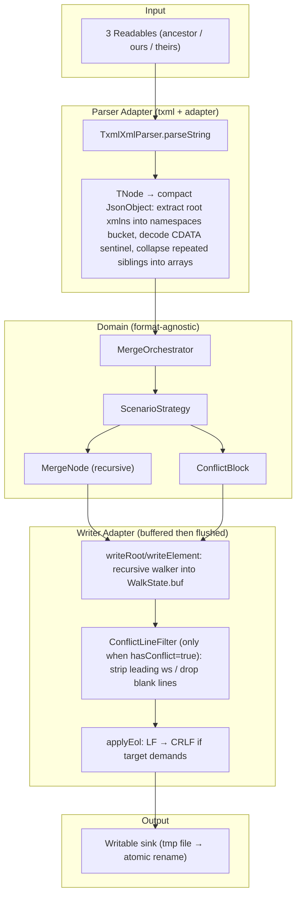
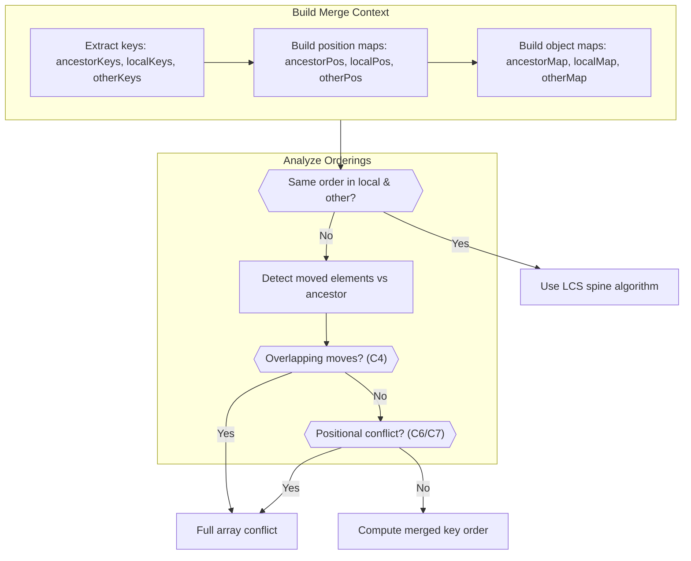
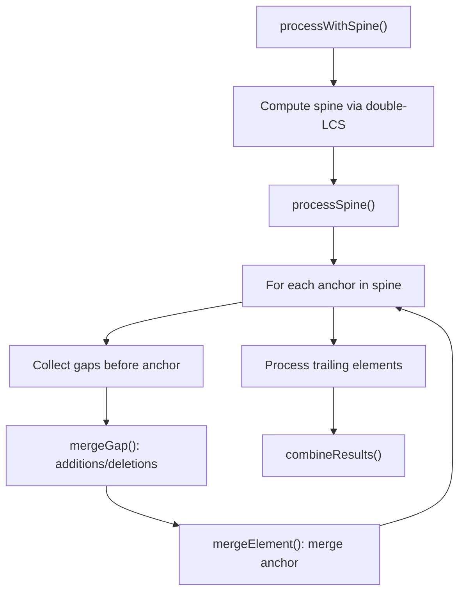

# Architecture Design Document

This document describes the software architecture of the Salesforce Git Merge Driver.

## Overview

The merge driver implements a three-way merge algorithm specifically designed for Salesforce metadata XML files. XML is parsed by a streaming reader into a compact JSON representation, the merge runs over that representation, and a recursive writer walks the merged tree into a single growable string buffer that is then written to the output sink. The writer is intentionally buffered rather than per-chunk streaming — at SF metadata sizes this is 30-45 % faster on serialize benches than the previous chunk-streaming approach (V8's cons-string optimisation + one final encode is cheaper than many small encoded writes).

## Design Patterns

### Strategy Pattern

The merge logic uses the **Strategy Pattern** to handle different merge scenarios. Each scenario (based on which versions have content) has its own strategy implementation.


```mermaid
classDiagram
    class ScenarioStrategy {
        <<interface>>
        +execute(context) MergeResult
    }

    ScenarioStrategy <|.. NoneStrategy
    ScenarioStrategy <|.. LocalOnlyStrategy
    ScenarioStrategy <|.. OtherOnlyStrategy
    ScenarioStrategy <|.. AncestorOnlyStrategy
    ScenarioStrategy <|.. LocalAndOtherStrategy
    ScenarioStrategy <|.. AncestorAndLocalStrategy
    ScenarioStrategy <|.. AncestorAndOtherStrategy
    ScenarioStrategy <|.. AllPresentStrategy
```

**Strategies:**
- `NoneStrategy` - No content in any source
- `LocalOnlyStrategy` - Only local has content
- `OtherOnlyStrategy` - Only other has content
- `AncestorOnlyStrategy` - Only ancestor has content (deleted in both)
- `LocalAndOtherStrategy` - Both added (no ancestor)
- `AncestorAndLocalStrategy` - Other deleted
- `AncestorAndOtherStrategy` - Local deleted
- `AllPresentStrategy` - Full three-way merge

### Composite Pattern

The merge nodes implement the **Composite Pattern** to handle different data structures uniformly.


```mermaid
classDiagram
    class MergeNode {
        <<interface>>
        +merge(config) MergeResult
    }

    MergeNode <|.. TextMergeNode
    MergeNode <|.. TextArrayMergeNode
    MergeNode <|.. KeyedArrayMergeNode
    MergeNode <|.. PropertyMergeNode
```

**Node Types:**
- `TextMergeNode` - Handles scalar/primitive values
- `TextArrayMergeNode` - Handles arrays of primitive values (e.g., `members` in package.xml)
- `KeyedArrayMergeNode` - Handles arrays of objects with key fields (e.g., `fieldPermissions` with `field` key)
- `PropertyMergeNode` - Handles pure objects without key extractor (property-by-property merge)

### Factory Pattern

The `MergeNodeFactory` creates the appropriate node type based on the data structure:


```mermaid
flowchart TD
    Start["createNode()"] --> IsStringArray{{"Is string array?"}}
    IsStringArray -->|Yes| TextArray["TextArrayMergeNode"]
    IsStringArray -->|No| IsPureObject{{"Pure object without key extractor?"}}
    IsPureObject -->|Yes| Object["PropertyMergeNode"]
    IsPureObject -->|No| IsObject{{"Contains objects?"}}
    IsObject -->|Yes| KeyedArray["KeyedArrayMergeNode"]
    IsObject -->|No| Text["TextMergeNode"]
```

Implementation: [MergeNodeFactory.ts](src/merger/nodes/MergeNodeFactory.ts)

## Core Components

### MergeOrchestrator

The central coordinator that:
1. Determines the merge scenario using the `getScenario()` function (in `MergeScenarioFactory.ts`)
2. Selects the appropriate strategy via `getScenarioStrategy()`
3. Builds the `MergeContext` and executes the strategy

Early termination when all inputs are equal lives in `AllPresentStrategy.execute()` (and `LocalAndOtherStrategy.execute()`) via `jsonEqual` fast-paths — see section "Early Termination Optimization" below.

```typescript
class MergeOrchestrator {
  merge(ancestor, local, other, attribute?, rootKey?): MergeResult
}
```

### MergeContext

Immutable context object passed to strategies:

```typescript
interface MergeContext {
  readonly config: MergeConfig
  // `| undefined` preserves the "key not present on this side" distinction
  // from JsonValue null so strategies can branch on existence separately.
  readonly ancestor: JsonValue | undefined
  readonly local: JsonValue | undefined
  readonly other: JsonValue | undefined
  readonly attribute: string | undefined
  readonly nodeFactory: MergeNodeFactory
  readonly rootKey: RootKeyInfo | undefined
}
```

### MergeScenario

Enum representing the 8 possible scenarios based on content presence:

| Scenario | Ancestor | Local | Other | Value (bitmask) |
|----------|----------|-------|-------|-----------------|
| NONE | - | - | - | 0 (000) |
| OTHER_ONLY | - | - | ✓ | 1 (001) |
| LOCAL_ONLY | - | ✓ | - | 2 (010) |
| LOCAL_AND_OTHER | - | ✓ | ✓ | 3 (011) |
| ANCESTOR_ONLY | ✓ | - | - | 4 (100) |
| ANCESTOR_AND_OTHER | ✓ | - | ✓ | 5 (101) |
| ANCESTOR_AND_LOCAL | ✓ | ✓ | - | 6 (110) |
| ALL | ✓ | ✓ | ✓ | 7 (111) |

### Conflict Handling

When conflicts cannot be auto-resolved, the merger produces `ConflictBlock` domain objects:

```typescript
interface ConflictBlock {
  readonly __conflict: true
  readonly local: JsonArray    // local version content
  readonly ancestor: JsonArray // ancestor version content
  readonly other: JsonArray    // other version content
}
```

The writer expands these into zdiff3-style conflict markers in the XML output:

```xml
<<<<<<< ours
    <field>localValue</field>
||||||| base
    <field>originalValue</field>
=======
    <field>remoteValue</field>
>>>>>>> theirs
```

Marker expansion happens inline as the writer walker visits each `ConflictBlock` — no separate post-processing pass. A two-pass `ConflictLineFilter` (strip horizontal whitespace before a marker, drop whitespace-only lines) keeps the byte layout identical to git's conventions; the filter runs only when the merger reports `hasConflict=true`.

### Ports & Adapters (Hexagonal Architecture)

The XML parsing and serialization are isolated behind port interfaces, keeping the merge domain free from library-specific format details. The parser reads from a `Readable`; the writer builds the serialized output into a single growable string buffer in one recursive walk, then emits it through `Writable.write` in one call (no-conflict path) or replays it through the conflict-line filter in 16 KiB windows (conflict path). The buffered approach is intentional — for SF metadata sizes (KB-MB) it beats per-chunk streaming by 30-45 % thanks to V8's cons-string optimisation.


```mermaid
classDiagram
    class XmlParser {
        <<interface>>
        +parseStream(input) Promise~NormalisedParseResult~
        +parseString(xml) NormalisedParseResult
    }

    class XmlSerializer {
        <<interface>>
        +writeTo(out, ordered, namespaces, eol, hasConflict) Promise~void~
    }

    class TxmlXmlParser {
        +parseStream(input) Promise~NormalisedParseResult~
        +parseString(xml) NormalisedParseResult
    }

    class XmlStreamWriter {
        +writeTo(out, ordered, namespaces, eol, hasConflict) Promise~void~
    }

    XmlParser <|.. TxmlXmlParser
    XmlSerializer <|.. XmlStreamWriter
```

- **`XmlParser` port** — Reads XML from a `Readable` (or a string), returns `NormalisedParseResult = { content, namespaces }`.
- **`XmlSerializer` port** — Writes the serialized document to a `Writable`: XML declaration, elements (open/close/cdata/comment), namespaces on the first top-level element, and inline conflict-block expansion. The optional `hasConflict` parameter (defaults to `true`) lets callers skip the conflict-line filter when the merge produced no `ConflictBlock` — the common case.
- **`TxmlXmlParser`** — Adapter wrapping the `txml` library (1.5 KiB gzipped, zero deps after our preprocess). Pre-processes `<![CDATA[…]]>` regions into a sentinel element before parsing (txml flattens CDATA into text, losing the boundary the writer needs to preserve). After parsing, walks tXml's `TNode { tagName, attributes, children }` tree once, converting it to the compact JsonObject shape the merger and writer expect: collapses repeated same-name siblings into arrays, prefixes attributes with `@_`, extracts root `xmlns*` into the namespaces bucket, decodes the CDATA sentinel back into `__cdata` keys, and runs a tag-balance check to throw on malformed input (txml itself is permissive). The conversion is benchmark-measured 62-67 % faster end-to-end than the previous `@nodable/flexible-xml-parser` adapter, with a -70 % bundle-size reduction (110 KiB → 33.5 KiB). See `docs/plans/2026-04-25-parser-spike-txml-vs-sax.md` for the spike that justified the swap.
- **`XmlStreamWriter`** — Single recursive walker (`writeRoot` → `writeElement` → `writeChildren`) that appends serialized XML directly to a mutable `WalkState.buf` string. No generators, no per-chunk object allocations, no `for...of` over generators. `getIndent` memoises the per-depth `\n + N×indent` prefix. The walker is sync; only `writeTo` is async, awaiting `out.write`'s drain signal once at the end (no-conflict path) or per 16 KiB filter window (conflict path).

## Binary Entry Point

Git invokes the merge driver for every metadata file conflict. To avoid loading the full oclif + `@salesforce/core` stack (~600 ms) on each invocation, a standalone binary is shipped alongside the oclif commands.

### Runtime Topology


```mermaid
flowchart TD
    subgraph Git["Git merge / rebase"]
        GitCfg[".git/config<br/>merge.salesforce-source.driver"]
    end

    subgraph Install["Install-time (one-off, via sf CLI)"]
        SfInstall["sf git merge driver install"]
        InstallSvc["InstallService<br/>resolves abs path via import.meta.url"]
    end

    subgraph Runtime["Runtime (per file, thousands per rebase)"]
        Binary["bin/merge-driver.cjs<br/>(esbuild-bundled, ~108 KB)"]
        ArgvParser["argv parser<br/>(no oclif, no SF core)"]
        MD["MergeDriver.mergeFiles"]
    end

    SfInstall --> InstallSvc -->|writes| GitCfg
    GitCfg -->|invokes per file| Binary
    Binary --> ArgvParser --> MD
```

### Invocation surfaces

The project exposes three entry points with distinct audiences and perf profiles:

| Surface | Audience | Performance | Notes |
|---|---|---|---|
| `sf git merge driver install` / `uninstall` | One-off setup per repo | Startup cost acceptable (runs once, then never again) | Resolves the binary path via `import.meta.url` and bakes it into `.git/config` so git invokes the binary directly — not `sf` — during merges. |
| `bin/merge-driver.cjs` directly | Git (per-file during merge/rebase) **and** scripting | ~37 ms cold start | Packaged with `"bin": { "sf-git-merge-driver": "./bin/merge-driver.cjs" }` in `package.json`; shebang `#!/usr/bin/env node` + mode 755. Scripting users resolve its path from the sf-installed plugin — see README "Advanced: direct binary invocation". |
| `sf git merge driver run` | **Deprecated** — scheduled for removal in the next major release | Slow (sf CLI + oclif + `@salesforce/core` stack) | Retained only for backward compatibility with `.git/config` entries generated by sf-git-merge-driver ≤ 1.5. Upgrading users are nudged toward `sf git merge driver install` by the in-README upgrade banner. |

Deprecation is encoded natively via oclif's command-level deprecation API
([command.d.ts `state` + `deprecationOptions`](https://github.com/oclif/core)):

- `static readonly state = 'deprecated'` on `src/commands/git/merge/driver/run.ts`
  causes oclif to emit a `formatCommandDeprecationWarning` on every invocation
  and mark the command deprecated in `--help` output.
- `static readonly deprecationOptions = { version, to }` supplies the target
  version and redirection so the warning is actionable, not just noise.
- The description in `messages/run.md` opens with `DEPRECATED` so `--help`
  reinforces the runtime banner.

### Build Pipeline

The binary is produced by esbuild from the compiled TypeScript:

```
src/**/*.ts → tsc → lib/**/*.js → esbuild (minify, treeshake, cjs) → bin/merge-driver.cjs (~108 KB, mode 755)
```

Key build choices:
- `keepNames: false` — saves ~22 KB; `@log('ClassName')` decorator passes names as string literals instead
- Shebang + compile-cache banner — `module.enableCompileCache()` gated on Node ≥ 22.8 (stable API)
- `__VERSION__` + `__BUNDLED__` injected via esbuild `--define` from `package.json`

Implementation: [tooling/build-bin.mjs](tooling/build-bin.mjs)

### Logging

The binary uses a pure-Node NDJSON logger ([LoggingService.ts](src/utils/LoggingService.ts)) that replaces `@salesforce/core` Logger across all command paths:

- Reads `SF_LOG_LEVEL` (fallback `SFDX_LOG_LEVEL`); default `warn` — zero I/O on the hot path
- Writes to `~/.sf/sf-YYYY-MM-DD.log` via `appendFileSync` (best-effort, failures swallowed)
- `SF_LOG_STDERR=true` mirrors to stderr
- Format: `{"level":N,"time":ms,"pid":N,"hostname":"...","name":"sf-git-merge-driver","msg":"..."}`

The `@log('ClassName')` decorator ([LoggingDecorator.ts](src/utils/LoggingDecorator.ts)) emits trace-level entry/exit logs for instrumented methods, including on async rejection and sync throw.

When the resolved log threshold at module init is above `trace` (the usual case — default is `warn`), the decorator installs **no wrapper at all**: the descriptor is left untouched, so decorated methods fall through unchanged with no closure, tagged-template, or async-detection cost per call. The short-circuit is evaluated exactly once per process via `isLevelEnabled(LOG_LEVELS.trace)`.

### Deep Equality

Element comparison uses a custom iterative `jsonEqual` ([jsonEqual.ts](src/utils/jsonEqual.ts)) instead of `fast-equals`. Stack-safe via explicit work stack; key-order-independent for objects, order-significant for arrays.

## Data Flow

`MergeDriver.mergeFiles` opens three `Readable`s on ancestor/ours/theirs, parses them in parallel, merges in memory, then streams the result through `XmlStreamWriter` into a temp file that is atomically renamed over `ours` on success.


```mermaid
flowchart TD
    subgraph Input
        XML["3 Readables (ancestor / ours / theirs)"]
    end

    subgraph "Parser Adapter (txml + adapter)"
        Parse["TxmlXmlParser.parseString"]
        Normalise["TNode → compact JsonObject: extract root xmlns into namespaces bucket, decode CDATA sentinel, collapse repeated siblings into arrays"]
    end

    subgraph "Domain (format-agnostic)"
        Orchestrator["MergeOrchestrator"]
        Strategy["ScenarioStrategy"]
        Nodes["MergeNode (recursive)"]
        Conflict["ConflictBlock"]
    end

    subgraph "Writer Adapter (buffered then flushed)"
        Walk["writeRoot/writeElement: recursive walker into WalkState.buf"]
        Filter["ConflictLineFilter (only when hasConflict=true): strip leading ws / drop blank lines"]
        Eol["applyEol: LF → CRLF if target demands"]
    end

    subgraph Output
        Result["Writable sink (tmp file → atomic rename)"]
    end

    XML --> Parse --> Normalise --> Orchestrator
    Orchestrator --> Strategy
    Strategy --> Nodes
    Strategy --> Conflict
    Nodes --> Walk
    Conflict --> Walk
    Walk --> Filter --> Eol --> Result
```

## Key Design Decisions

### 1. Compact JSON Intermediate Representation

XML is converted to a compact JSON format for easier manipulation. The domain operates on plain JSON objects without knowledge of any XML parser library's conventions:
- Scalars are plain values: `{ field: "value" }`
- Nested elements are child objects: `{ parent: { child: "value" } }`
- Namespace attributes are extracted by the parser adapter into a dedicated bucket, not left on the root element
- The writer adapter walks the compact tree directly — splitting attributes (`@_`-prefixed keys) from children, expanding `ConflictBlock` objects inline into text markers, and appending bytes to a single growable buffer without materialising an intermediate ordered representation or generator chunk objects

### 2. Key-Based Array Merging

Salesforce metadata arrays (like `fieldPermissions`) use semantic keys rather than position-based merging. The driver identifies key fields from metadata configuration to match elements across versions.

### 3. Early Termination Optimization

When all three inputs are deeply equal, the merge returns immediately without traversing the structure. This significantly improves performance for unchanged files.

### 4. Immutable Context

The `MergeContext` is immutable, ensuring strategies cannot accidentally modify shared state.

### 5. Configurable Conflict Markers

Conflict marker size and labels are configurable via Git's standard parameters (`-L`, `-S`, `-X`, `-Y` flags), allowing integration with existing Git workflows.

## Deterministic Ordering Algorithm

For ordered metadata types (e.g., `GlobalValueSet`, `StandardValueSet`), the driver implements a deterministic three-way merge algorithm that preserves element ordering while detecting and merging compatible changes.

### Core Principles

1. **User decides order** — never auto-resolve ambiguous ordering conflicts
2. **Value-based comparison** — elements are compared by their key field, not position
3. **Disjoint change detection** — non-overlapping reorderings can be merged automatically
4. **Conflict on overlap** — when both sides move the same elements differently, conflict
5. **Positional conflict detection** — concurrent additions at different positions trigger conflict

### Algorithm Overview

The `OrderedKeyedArrayMergeStrategy` handles ordered arrays through these steps:


```mermaid
flowchart TD
    subgraph Build["Build Merge Context"]
        Extract["Extract keys: ancestorKeys, localKeys, otherKeys"]
        Maps["Build position maps: ancestorPos, localPos, otherPos"]
        ObjMaps["Build object maps: ancestorMap, localMap, otherMap"]
        Extract --> Maps --> ObjMaps
    end

    subgraph Analyze["Analyze Orderings"]
        FastPath{{"Same order in local & other?"}}
        Moved["Detect moved elements vs ancestor"]
        Overlap{{"Overlapping moves? (C4)"}}
        Position{{"Positional conflict? (C6/C7)"}}
    end

    Build --> FastPath
    FastPath -->|Yes| Spine["Use LCS spine algorithm"]
    FastPath -->|No| Moved
    Moved --> Overlap
    Overlap -->|Yes| Conflict["Full array conflict"]
    Overlap -->|No| Position
    Position -->|Yes| Conflict
    Position -->|No| Disjoint["Compute merged key order"]
```

### Moved Element Detection

An element is considered "moved" if its relative order with any other element changed between ancestor and modified version. Uses upper-triangle optimization to avoid redundant pair comparisons:

```typescript
// For each pair (a, b) where a comes before b in ancestor:
// If a comes after b in modified → both a and b are "moved"
for (i = 0; i < ancestorKeys.length; i++) {
  for (j = i + 1; j < ancestorKeys.length; j++) {
    if (modifiedPos[a] > modifiedPos[b]) {
      moved.add(a); moved.add(b)
    }
  }
}
```

### Positional Conflict Detection (C6)

When both sides add the same element but at different relative positions, a conflict is triggered. This is detected by comparing the relative order of added elements against all common elements:

```typescript
// For element added by both sides:
// Check if its position relative to any common element differs
if (addedLocalPos < keyLocalPos !== addedOtherPos < keyOtherPos) {
  return true // Positional conflict
}
```

### Merge Scenarios

| ID | Scenario | Behavior |
|----|----------|----------|
| M1-M9 | Standard merges | Additions, deletions, modifications handled by spine algorithm |
| M10 | Disjoint swaps | Local swaps {A,B}, other swaps {C,D} → merge both |
| C4 | Divergent moves | Both sides move same element differently → conflict |
| C6 | Positional conflict | Both sides add same element at different positions → conflict |
| C7 | Concurrent addition with diverged orderings | Both sides add different elements while orderings diverge → conflict |

### Example: M10 Disjoint Swaps

```
Ancestor: [A, B, C, D]
Local:    [B, A, C, D]  ← swapped A↔B
Other:    [A, B, D, C]  ← swapped C↔D

Analysis:
- localMoved  = {A, B}  (A and B changed relative order)
- otherMoved  = {C, D}  (C and D changed relative order)
- Intersection = ∅      (disjoint changes)

Merge:
- Apply local's order for {A,B}: [B, A]
- Apply other's order for {C,D}: [D, C]
- Result: [B, A, D, C]
```

### Example: C6 Positional Conflict

```
Ancestor: [A, B]
Local:    [A, X, B]     ← added X between A and B
Other:    [X, A, B]     ← added X before A

Analysis:
- X added by both, but at different positions
- In local: X is after A
- In other: X is before A
- Relative order conflict → full array conflict
```

### Example: C7 Concurrent Addition with Diverged Orderings

```
Ancestor: [A, B]
Local:    [B, A, X]     ← swapped A↔B, added X
Other:    [A, B, Y]     ← added Y

Analysis:
- localMoved = {A, B} (swapped)
- Both sides added different elements (X vs Y)
- Ambiguous: should result be [B, A, X, Y] or [B, A, Y, X]?
- Concurrent additions with diverged orderings → full array conflict
```

### Implementation

Key methods in `OrderedKeyedArrayMergeStrategy` ([OrderedKeyedArrayMergeStrategy.ts](src/merger/nodes/OrderedKeyedArrayMergeStrategy.ts)):

| Method | Purpose |
|--------|---------|
| `buildArrayMergeState()` | Extracts keys and builds position/object maps for O(1) lookups |
| `analyzeOrderings(ctx)` | Returns `{canMerge, localMoved, otherMoved}` — detects C4 (overlapping moves) and C6 (positional conflicts) |
| `getMovedElements(ctx, modifiedPos)` | Finds elements that changed relative order |
| `computeMergedKeyOrder(ctx, analysis)` | Builds merged key order; returns null for C7 conflict |
| `processDivergedOrderings(config, ctx, analysis)` | Handles disjoint reorderings |
| `processWithSpine(config, ctx)` | Uses LCS for spine-based merge |
| `processSpine(config, spine, ctx)` | Iterates spine anchors, processes gaps between them |

### Spine-Based Merge Algorithm

The spine-based merge uses the [Longest Common Subsequence (LCS)](https://en.wikipedia.org/wiki/Longest_common_subsequence) algorithm to identify stable anchor points between versions.

#### Spine Computation

The **spine** is the stable backbone of elements present in all versions with preserved relative order:

```typescript
spine = lcs(lcs(ancestor, local), lcs(ancestor, other))
```

Implementation: [OrderedKeyedArrayMergeStrategy.ts](src/merger/nodes/OrderedKeyedArrayMergeStrategy.ts)

#### Process Flow


```mermaid
flowchart TD
    Start["processWithSpine()"] --> Compute["Compute spine via double-LCS"]
    Compute --> Process["processSpine()"]

    Process --> ForEach["For each anchor in spine"]
    ForEach --> CollectGaps["Collect gaps before anchor"]
    CollectGaps --> MergeGap["mergeGap(): additions/deletions"]
    MergeGap --> MergeAnchor["mergeElement(): merge anchor"]
    MergeAnchor --> ForEach

    ForEach --> Trailing["Process trailing elements"]
    Trailing --> Combine["combineResults()"]
```

#### Example

```
Ancestor: [A, B, C, D, E]
Local:    [A, X, B, D]      ← deleted C, E; added X
Other:    [A, B, Y, D, E]   ← added Y

spine = [A, B, D]

Gaps processed:
  before B: local adds X
  before D: other adds Y, local deletes C
  trailing: local deletes E

Result: [A, X, B, Y, D]
```

### Applicable Metadata Types

Ordered merging applies to metadata with position-significant arrays:

- `GlobalValueSet` → `customValue` (key: `fullName`)
- `StandardValueSet` → `standardValue` (key: `fullName`)
- `CustomField` → `valueSet.customValue` (key: `fullName`)
- `RecordType` → `picklistValues.values` (key: `fullName`)
