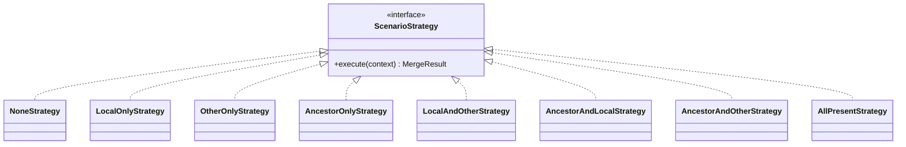
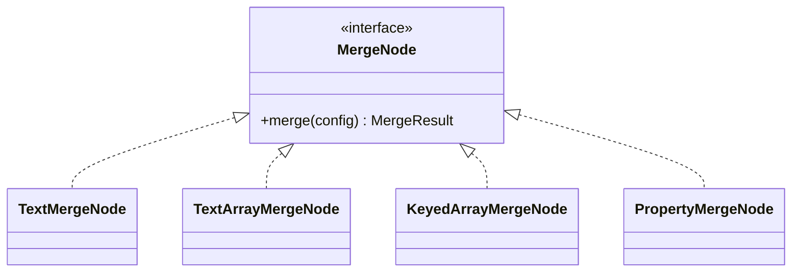
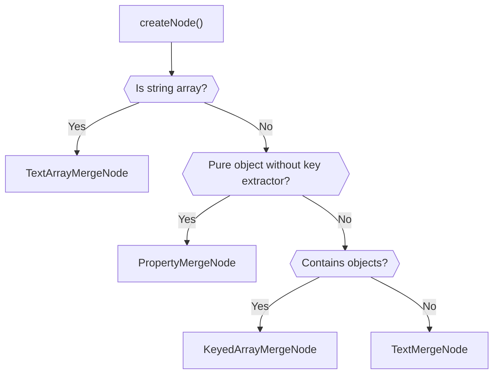
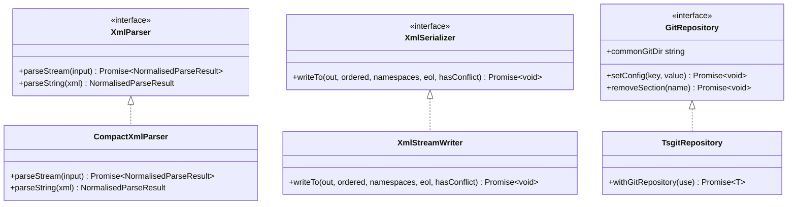
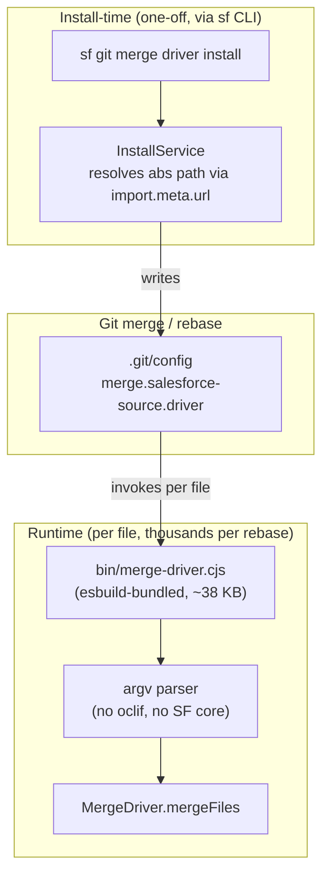
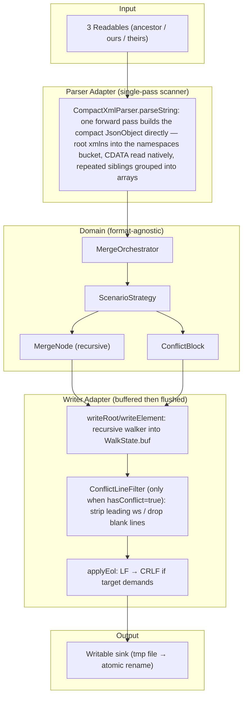
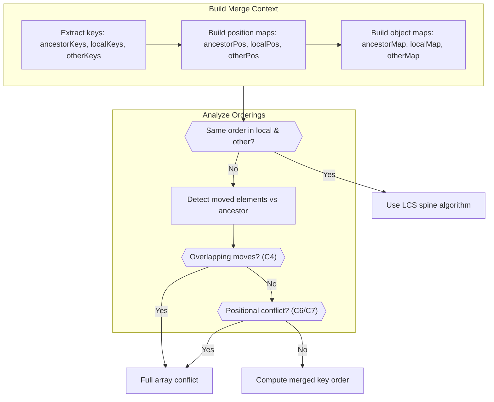
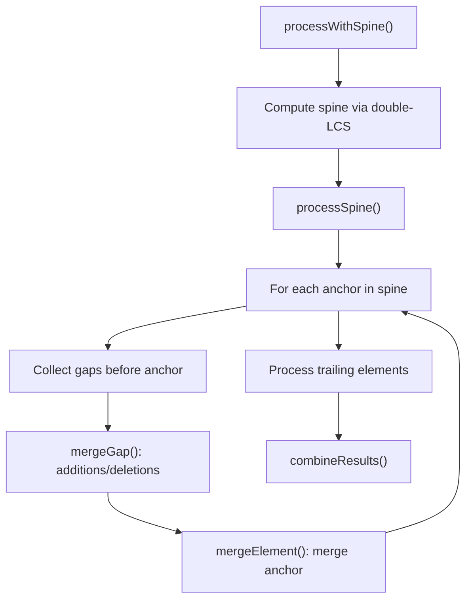

# Architecture Design Document

This document describes the software architecture of the Salesforce Git Merge Driver.

## Overview

The merge driver implements a three-way merge algorithm specifically designed for Salesforce metadata XML files. XML is parsed by a streaming reader into a compact JSON representation, the merge runs over that representation, and a recursive writer walks the merged tree into a single growable string buffer that is then written to the output sink. The writer is intentionally buffered rather than per-chunk streaming — at SF metadata sizes this is 30-45 % faster on serialize benches than the previous chunk-streaming approach (V8's cons-string optimisation + one final encode is cheaper than many small encoded writes).

## Design Patterns

### Strategy Pattern

The merge logic uses the **Strategy Pattern** to handle different merge scenarios. Each scenario (based on which versions have content) has its own strategy implementation.


```mermaid
classDiagram
    class ScenarioStrategy {
        <<interface>>
        +execute(context) MergeResult
    }

    ScenarioStrategy <|.. NoneStrategy
    ScenarioStrategy <|.. LocalOnlyStrategy
    ScenarioStrategy <|.. OtherOnlyStrategy
    ScenarioStrategy <|.. AncestorOnlyStrategy
    ScenarioStrategy <|.. LocalAndOtherStrategy
    ScenarioStrategy <|.. AncestorAndLocalStrategy
    ScenarioStrategy <|.. AncestorAndOtherStrategy
    ScenarioStrategy <|.. AllPresentStrategy
```

**Strategies:**
- `NoneStrategy` - No content in any source
- `LocalOnlyStrategy` - Only local has content
- `OtherOnlyStrategy` - Only other has content
- `AncestorOnlyStrategy` - Only ancestor has content (deleted in both)
- `LocalAndOtherStrategy` - Both added (no ancestor)
- `AncestorAndLocalStrategy` - Other deleted
- `AncestorAndOtherStrategy` - Local deleted
- `AllPresentStrategy` - Full three-way merge

### Composite Pattern

The merge nodes implement the **Composite Pattern** to handle different data structures uniformly.


```mermaid
classDiagram
    class MergeNode {
        <<interface>>
        +merge(config) MergeResult
    }

    MergeNode <|.. TextMergeNode
    MergeNode <|.. TextArrayMergeNode
    MergeNode <|.. KeyedArrayMergeNode
    MergeNode <|.. PropertyMergeNode
```

**Node Types:**
- `TextMergeNode` - Handles scalar/primitive values
- `TextArrayMergeNode` - Handles arrays of primitive values (e.g., `members` in package.xml)
- `KeyedArrayMergeNode` - Handles arrays of objects with key fields (e.g., `fieldPermissions` with `field` key)
- `PropertyMergeNode` - Handles pure objects without key extractor (property-by-property merge). A side where the element is absent is normalised at the factory, before the node is constructed, to a shared frozen stand-in that contributes no properties, so additions and deletions propagate instead of crashing. That stand-in is built with `Object.create(null)` for the same reason the parser builds every node that way: an XML tag name is untrusted, and a plain `{}` would let a name such as `constructor` or `toString` resolve through `Object.prototype`, resurrecting an element the side had deleted. A side holding text rather than child elements is deliberately *not* normalised — see "Empty Text Is Indistinguishable From an Absent Tag" under Known Limitations

### Factory Pattern

The `MergeNodeFactory` creates the appropriate node type based on the data structure:


```mermaid
flowchart TD
    Start["createNode()"] --> IsStringArray{{"Is string array?"}}
    IsStringArray -->|Yes| TextArray["TextArrayMergeNode"]
    IsStringArray -->|No| IsPureObject{{"Pure object without key extractor?"}}
    IsPureObject -->|Yes| Object["PropertyMergeNode"]
    IsPureObject -->|No| IsObject{{"Contains objects?"}}
    IsObject -->|Yes| KeyedArray["KeyedArrayMergeNode"]
    IsObject -->|No| Text["TextMergeNode"]
```

Implementation: [MergeNodeFactory.ts](src/merger/nodes/MergeNodeFactory.ts)

## Core Components

### MergeOrchestrator

The central coordinator that:
1. Determines the merge scenario using the `getScenario()` function (in `MergeScenarioFactory.ts`)
2. Selects the appropriate strategy via `getScenarioStrategy()`
3. Builds the `MergeContext` and executes the strategy

Early termination when all inputs are equal lives in `AllPresentStrategy.execute()` (and `LocalAndOtherStrategy.execute()`) via `jsonEqual` fast-paths — see section "Early Termination Optimization" below.

```typescript
class MergeOrchestrator {
  merge(ancestor, local, other, attribute?, rootKey?): MergeResult
}
```

### MergeContext

Immutable context object passed to strategies:

```typescript
interface MergeContext {
  readonly config: MergeConfig
  // `| undefined` preserves the "key not present on this side" distinction
  // from JsonValue null so strategies can branch on existence separately.
  readonly ancestor: JsonValue | undefined
  readonly local: JsonValue | undefined
  readonly other: JsonValue | undefined
  readonly attribute: string | undefined
  readonly nodeFactory: MergeNodeFactory
  readonly rootKey: RootKeyInfo | undefined
}
```

### MergeScenario

Enum representing the 8 possible scenarios based on content presence:

| Scenario | Ancestor | Local | Other | Value (bitmask) |
|----------|----------|-------|-------|-----------------|
| NONE | - | - | - | 0 (000) |
| OTHER_ONLY | - | - | ✓ | 1 (001) |
| LOCAL_ONLY | - | ✓ | - | 2 (010) |
| LOCAL_AND_OTHER | - | ✓ | ✓ | 3 (011) |
| ANCESTOR_ONLY | ✓ | - | - | 4 (100) |
| ANCESTOR_AND_OTHER | ✓ | - | ✓ | 5 (101) |
| ANCESTOR_AND_LOCAL | ✓ | ✓ | - | 6 (110) |
| ALL | ✓ | ✓ | ✓ | 7 (111) |

### Conflict Handling

When conflicts cannot be auto-resolved, the merger produces `ConflictBlock` domain objects:

```typescript
interface ConflictBlock {
  readonly __conflict: true
  readonly local: JsonArray    // local version content
  readonly ancestor: JsonArray // ancestor version content
  readonly other: JsonArray    // other version content
}
```

The writer expands these into zdiff3-style conflict markers in the XML output:

```xml
<<<<<<< ours
    <field>localValue</field>
||||||| base
    <field>originalValue</field>
=======
    <field>remoteValue</field>
>>>>>>> theirs
```

Each conflict side's root element carries the merged root namespaces, so resolving the conflict by keeping either side yields a document whose root still declares them. All three sides receive the *merged* bucket, including `||||||| base` — the base side is rendered as a resolution source, not as a byte-faithful reproduction of the ancestor blob, so a namespace added or removed by a live side shows up there too.

Marker expansion happens inline as the writer walker visits each `ConflictBlock` — no separate post-processing pass. A two-pass `ConflictLineFilter` (strip horizontal whitespace before a marker, drop whitespace-only lines) keeps the byte layout identical to git's conventions; the filter runs only when the merger reports `hasConflict=true`.

### Ports & Adapters (Hexagonal Architecture)

The XML parsing and serialization are isolated behind port interfaces, keeping the merge domain free from library-specific format details. The parser reads from a `Readable`; the writer builds the serialized output into a single growable string buffer in one recursive walk, then emits it through `Writable.write` in one call (no-conflict path) or replays it through the conflict-line filter in 16 KiB windows (conflict path). The buffered approach is intentional — for SF metadata sizes (KB-MB) it beats per-chunk streaming by 30-45 % thanks to V8's cons-string optimisation.


```mermaid
classDiagram
    class XmlParser {
        <<interface>>
        +parseStream(input) Promise~NormalisedParseResult~
        +parseString(xml) NormalisedParseResult
    }

    class XmlSerializer {
        <<interface>>
        +writeTo(out, ordered, namespaces, eol, hasConflict) Promise~void~
    }

    class CompactXmlParser {
        +parseStream(input) Promise~NormalisedParseResult~
        +parseString(xml) NormalisedParseResult
    }

    class XmlStreamWriter {
        +writeTo(out, ordered, namespaces, eol, hasConflict) Promise~void~
    }

    XmlParser <|.. CompactXmlParser
    XmlSerializer <|.. XmlStreamWriter

    class GitRepository {
        <<interface>>
        +commonGitDir string
        +setConfig(key, value) Promise~void~
        +removeSection(name) Promise~void~
    }

    class TsgitRepository {
        +withGitRepository(use) Promise~T~
    }

    GitRepository <|.. TsgitRepository
```

- **`XmlParser` port** — Reads XML from a `Readable` (or a string), returns `NormalisedParseResult = { content, namespaces }`.
- **`XmlSerializer` port** — Writes the serialized document to a `Writable`: XML declaration, elements (open/close/cdata/comment), namespaces on the first top-level element, and inline conflict-block expansion. When the whole document is a single conflict block there is no first top-level element, so the root element of each non-blank side carries the namespaces instead. The optional `hasConflict` parameter (defaults to `true`) lets callers skip the conflict-line filter when the merge produced no `ConflictBlock` — the common case.
- **`CompactXmlParser`** — Adapter with no third-party XML library: `scanDocument` (`src/adapter/parser/scanDocument.ts`) makes one forward pass over the source string, pushing an `ElementFrame` accumulator on each open tag and popping it into its parent on the matching close, building the compact JsonObject shape the merger and writer expect directly — no intermediate DOM, no separate normalise walk. `<![CDATA[…]]>` sections are read natively into `__cdata` keys; there is no sentinel rewrite. The fast path resolves attributes, closes, comments and CDATA inline; when it meets a construct its lexer can't disambiguate on its own (a stray quote inside an unquoted attribute or close-tag text, or a comment shorter than `<!---->`) it sets a `needsOracle` flag instead of guessing, and `assertBalancedTags` (`src/adapter/parser/balanceOracle.ts`) re-walks the document quote-aware to settle it; a scan failure runs the oracle first, so its balance-family message wins when both passes reject the input. Contract: **byte-exact on Salesforce-shaped XML, XML-correct elsewhere**. Benchmark-measured 32-43 % faster on the parse phase than the previous adapter across medium/large/xl fixture tiers, at a near-identical bundle size now that the external parser dependency is gone.
- **`XmlStreamWriter`** — Single recursive walker (`writeRoot` → `writeElement` → `writeChildren`) that appends serialized XML directly to a mutable `WalkState.buf` string. No generators, no per-chunk object allocations, no `for...of` over generators. `getIndent` memoises the per-depth `\n + N×indent` prefix. The walker is sync; only `writeTo` is async, awaiting `out.write`'s drain signal once at the end (no-conflict path) or per 16 KiB filter window (conflict path). Child element tags and attributes within each node are emitted in **first-seen (source) order** — the insertion order of keys in the compact JSON object as set by the parser — rather than alphabetical order. Because `CompactXmlParser` preserves source tag order and `sf project retrieve` writes files in the Metadata API XSD `xs:sequence` order, the driver's output matches the canonical Salesforce order for retrieve-sourced files. This is a layout-only property: it does not affect merge decisions (see §6 below).
- **`GitRepository` port** — Exposes `commonGitDir` (absolute path to the repository's shared git directory), `setConfig(key, value)`, and `removeSection(name)`. Keeps `gitAttributesPath.ts`, `InstallService`, and `UninstallService` free of any git-library import; the port throws `NotAGitRepositoryError` when the caller is not inside a git working tree.
- **`TsgitRepository`** — The single file that imports `@scolladon/tsgit`, wired through `withGitRepository(use)`. Opens the repository with `hooks: false` and `command: false` so a hostile repository's `.git/hooks/*` scripts or a configured `[merge].driver` command can never execute during install/uninstall. `openRepository` itself succeeds even outside a repository, returning a synthetic layout, so a probe of `core.repositoryformatversion` (local scope) runs before anything reads the layout — that probe, not the open, is what proves the current directory is a real repository. The handle is disposed in a `finally`. The shared git dir is resolved with the vendor's own `commonDirOf(layout)` (from the `@scolladon/tsgit/primitives` subpath) rather than a hand-rolled `commonDir ?? gitDir`, so the linked-worktree semantics stay owned by the library. `GIT_DIR` and `GIT_COMMON_DIR` are read here and forwarded as explicit `gitDir` / `commonDir` options, because tsgit consults no environment variable of its own.

## Binary Entry Point

Git invokes the merge driver for every metadata file conflict. To avoid loading the full oclif + `@salesforce/core` stack (~600 ms) on each invocation, a standalone binary is shipped alongside the oclif commands.

### Runtime Topology


```mermaid
flowchart TD
    subgraph Git["Git merge / rebase"]
        GitCfg[".git/config<br/>merge.salesforce-source.driver"]
    end

    subgraph Install["Install-time (one-off, via sf CLI)"]
        SfInstall["sf git merge driver install"]
        InstallSvc["InstallService<br/>resolves abs path via import.meta.url"]
    end

    subgraph Runtime["Runtime (per file, thousands per rebase)"]
        Binary["bin/merge-driver.cjs<br/>(esbuild-bundled, ~38 KB)"]
        ArgvParser["argv parser<br/>(no oclif, no SF core)"]
        MD["MergeDriver.mergeFiles"]
    end

    SfInstall --> InstallSvc -->|writes| GitCfg
    GitCfg -->|invokes per file| Binary
    Binary --> ArgvParser --> MD
```

### Invocation surfaces

The project exposes three entry points with distinct audiences and perf profiles:

| Surface | Audience | Performance | Notes |
|---|---|---|---|
| `sf git merge driver install` / `uninstall` | One-off setup per repo | Startup cost acceptable (runs once, then never again) | Resolves the binary path via `import.meta.url` and bakes it into `.git/config` so git invokes the binary directly — not `sf` — during merges. |
| `bin/merge-driver.cjs` directly | Git (per-file during merge/rebase) **and** scripting | ~37 ms cold start | Packaged with `"bin": { "sf-git-merge-driver": "./bin/merge-driver.cjs" }` in `package.json`; shebang `#!/usr/bin/env node` + mode 755. Scripting users resolve its path from the sf-installed plugin — see README "Advanced: direct binary invocation". |
| `sf git merge driver run` | **Deprecated** — scheduled for removal in the next major release | Slow (sf CLI + oclif + `@salesforce/core` stack) | Retained only for backward compatibility with `.git/config` entries generated by sf-git-merge-driver ≤ 1.5. Upgrading users are nudged toward `sf git merge driver install` by the in-README upgrade banner. |

Deprecation is encoded natively via oclif's command-level deprecation API
([command.d.ts `state` + `deprecationOptions`](https://github.com/oclif/core)):

- `static readonly state = 'deprecated'` on `src/commands/git/merge/driver/run.ts`
  causes oclif to emit a `formatCommandDeprecationWarning` on every invocation
  and mark the command deprecated in `--help` output.
- `static readonly deprecationOptions = { version, to }` supplies the target
  version and redirection so the warning is actionable, not just noise.
- The description in `messages/run.md` opens with `DEPRECATED` so `--help`
  reinforces the runtime banner.

### Build Pipeline

The binary is produced by esbuild from the compiled TypeScript:

```
src/**/*.ts → tsc → lib/**/*.js → esbuild (minify, treeshake, cjs) → bin/merge-driver.cjs (~38 KB, mode 755)
```

Key build choices:
- `keepNames: false` — saves ~22 KB; `@log('ClassName')` decorator passes names as string literals instead
- Shebang banner only. `module.enableCompileCache()` was measured as a no-op for a single-file bundle (see *Measured and rejected*)
- `__VERSION__` + `__BUNDLED__` injected via esbuild `--define` from `package.json`

Implementation: [tooling/build-bin.mjs](tooling/build-bin.mjs)

### Logging

The binary uses a pure-Node NDJSON logger ([LoggingService.ts](src/utils/LoggingService.ts)) that replaces `@salesforce/core` Logger across all command paths:

- Reads `SF_LOG_LEVEL` (fallback `SFDX_LOG_LEVEL`); default `warn` — zero I/O on the hot path
- Writes to `~/.sf/sf-YYYY-MM-DD.log` via `appendFileSync` (best-effort, failures swallowed)
- `SF_LOG_STDERR=true` mirrors to stderr
- Format: `{"level":N,"time":ms,"pid":N,"hostname":"...","name":"sf-git-merge-driver","msg":"..."}`

The `@log('ClassName')` decorator ([LoggingDecorator.ts](src/utils/LoggingDecorator.ts)) emits trace-level entry/exit logs for instrumented methods, including on async rejection and sync throw.

When the resolved log threshold at module init is above `trace` (the usual case — default is `warn`), the decorator installs **no wrapper at all**: the descriptor is left untouched, so decorated methods fall through unchanged with no closure, tagged-template, or async-detection cost per call. The short-circuit is evaluated exactly once per process via `isLevelEnabled(LOG_LEVELS.trace)`.

### Deep Equality

Element comparison uses a custom iterative `jsonEqual` ([jsonEqual.ts](src/utils/jsonEqual.ts)) instead of `fast-equals`. Stack-safe via explicit work stack; key-order-independent for objects, order-significant for arrays.

## Data Flow

`MergeDriver.mergeFiles` opens three `Readable`s on ancestor/ours/theirs, parses them in parallel, merges in memory, then streams the result through `XmlStreamWriter` into a temp file that is atomically renamed over `ours` on success.


```mermaid
flowchart TD
    subgraph Input
        XML["3 Readables (ancestor / ours / theirs)"]
    end

    subgraph "Parser Adapter (single-pass scanner)"
        Parse["CompactXmlParser.parseString: one forward pass builds the compact JsonObject directly — root xmlns into the namespaces bucket, CDATA read natively, repeated siblings grouped into arrays"]
    end

    subgraph "Domain (format-agnostic)"
        Orchestrator["MergeOrchestrator"]
        Strategy["ScenarioStrategy"]
        Nodes["MergeNode (recursive)"]
        Conflict["ConflictBlock"]
    end

    subgraph "Writer Adapter (buffered then flushed)"
        Walk["writeRoot/writeElement: recursive walker into WalkState.buf"]
        Filter["ConflictLineFilter (only when hasConflict=true): strip leading ws / drop blank lines"]
        Eol["applyEol: LF → CRLF if target demands"]
    end

    subgraph Output
        Result["Writable sink (tmp file → atomic rename)"]
    end

    XML --> Parse --> Orchestrator
    Orchestrator --> Strategy
    Strategy --> Nodes
    Strategy --> Conflict
    Nodes --> Walk
    Conflict --> Walk
    Walk --> Filter --> Eol --> Result
```

## Key Design Decisions

### 1. Compact JSON Intermediate Representation

XML is converted to a compact JSON format for easier manipulation. The domain operates on plain JSON objects without knowledge of any XML parser library's conventions:
- Scalars are plain values: `{ field: "value" }`
- Nested elements are child objects: `{ parent: { child: "value" } }`
- Namespace attributes are extracted by the parser adapter into a dedicated bucket, not left on the root element
- The writer adapter walks the compact tree directly — splitting attributes (`@_`-prefixed keys) from children, expanding `ConflictBlock` objects inline into text markers, and appending bytes to a single growable buffer without materialising an intermediate ordered representation or generator chunk objects

### 2. Key-Based Array Merging

Salesforce metadata arrays (like `fieldPermissions`) use semantic keys rather than position-based merging. The driver identifies key fields from metadata configuration to match elements across versions.

#### Shared element names across schemas

Salesforce reuses the same XML element name across unrelated parent schemas with **different key fields**. The `picklistValues` extractor in `MetadataService.ts` is the canonical example — it must support both schemas with a prefer-then-fallback pattern:

| Element | Parent schema | Key field |
|---|---|---|
| `picklistValues` | `CustomObjectTranslation.fields[]` | `masterLabel` |
| `picklistValues` | `RecordType` | `picklist` |
| `sections` | `Translations` | `name` |
| `sections` | `CustomObjectTranslation` | `section` |

The convention for resolving the ambiguity is to read each candidate property via `getPropertyValue` (which returns the literal string `"undefined"` when absent — see `String(undefined)` sentinel idiom) and pick the first non-sentinel value. **Failing to do this causes silent data loss**: every block under the wrong-schema document keys to the same `"undefined"` string and `buildKeyedMap` retains only the last entry. New extractors that share an element name with an existing schema must follow the same prefer-then-fallback shape.

### 3. Early Termination Optimization

When all three inputs are deeply equal, the merge returns immediately without traversing the structure. This significantly improves performance for unchanged files.

The early result returns the raw parsed value rather than the per-element wrapper shape the rest of the pipeline emits. The parser groups repeated siblings under one key (`{tag: [entry1, entry2]}`), so `buildEarlyResult` (`src/types/mergeResult.ts`) expands a single such grouped key into one wrapper per entry (`[{tag: entry1}, {tag: entry2}]`). Without this the writer would treat the array as a single element's body and collapse the repeats into one element — the failure mode for an element whose only child is a repeated keyed array (e.g. `CustomLabels` → `<labels>`), pinned by fixture `46-noop-single-keyed-array`.

### 4. Immutable Context

The `MergeContext` is immutable, ensuring strategies cannot accidentally modify shared state.

### 5. Configurable Conflict Markers

Conflict marker size and labels are configurable via Git's standard parameters (`-L`, `-S`, `-X`, `-Y` flags), allowing integration with existing Git workflows.

### 6. Canonical (First-Seen) XML Tag Order

Within every serialized node, child element tags and `xmlns*` attributes are emitted in **first-seen input order** — the order they appeared in the source XML — not alphabetical order. Alphabetical order enters only among the keys tied for the lowest residual indegree in the merge's precedence graph (below) — the genuinely unordered ones; every tag whose position any side determines outright keeps its first-seen position regardless. This is established at two points in the pipeline:

- **Merge-time**: `mergePropertyOrder` (`src/merger/mergePropertyOrder.ts`) merges the three sides' key *sequences*, not a flat set. It derives precedence edges from each side's consecutive key pairs — ancestor, local and other alike — and takes a Kahn topological sort over the union of the three key sets. Whenever several keys are simultaneously ready (indegree zero), or a cycle in the precedence graph leaves none ready, the next key is chosen among the unemitted keys with the **lowest residual indegree**, breaking ties by a **lexicographic** ordering of the key names (a bare `Array.prototype.sort()`, never `localeCompare`). Scoping the repair to the lowest-indegree keys — rather than the entire remaining set — keeps it confined to the actual cycle: a key downstream of a cycle but not part of it, whose position every side agrees on, is never displaced by that cycle's repair. A fast path — `sameSequence(local, other) && isSubsequence(ancestor, local)` — returns `local`'s key sequence directly whenever both sides already agree on an order the ancestor is consistent with; that condition makes the topological order unique, so the result there does not depend on the tie-break rank at all.
- **Write-time**: all three sort sites in `XmlStreamWriter` (`writeRoot`, `writeChildren`, `splitAttrsAndChildren`) preserve object key insertion order as returned by `Object.keys`, rather than calling `.sort()`.

Because `CompactXmlParser` preserves the source tag order (`ElementFrame.addChild` groups each child into a `Map` keyed by tag name, in first-seen order; `ElementFrame.toCompact` emits keys as `[attrs…, grouped tags in first-seen order…, #text last]`), and `sf project retrieve` writes files in the Metadata API XSD `xs:sequence` order, "emit first-seen key order" equals "emit XSD sequence order" for retrieve-sourced files — with no schema table to maintain.

**Parsed nodes are null-prototype**, and that is a pipeline-wide contract, not a parser-local detail. `ElementFrame.toCompact` builds each compact node with `Object.create(null)` because tag names come straight from untrusted XML and `__proto__` is a syntactically valid one: on a normal `{}`, `out['__proto__'] = value` invokes the inherited setter and rewrites the node's prototype instead of storing a child. Two obligations fall on every consumer of a parsed node:

- `key in node` is an **own-key test** — but only for parsed nodes. Objects the driver builds itself (the parser's `content` wrapper, constant tables such as `METADATA_KEY_EXTRACTORS` and `LEVELS`) still inherit from `Object.prototype`, so a key named `constructor`, `toString` or `__proto__` answers `true` there. Those lookups use `Object.hasOwn`.
- `String(node)` **throws** rather than coercing, because there is no inherited `toString`. Values that may be object-shaped are coerced through the local helpers in `MetadataService.getPropertyValue` (which yields the `String(undefined)` "absent" sentinel, so an unusable key field is filtered out) and `TextArrayMergeNode.toComparable` (which yields `JSON.stringify`, so distinct items stay distinguishable for sorting). The two differ deliberately: one needs the value to disappear, the other needs it to stay distinct.

This property is a **layout-only** concern: it does not affect which value wins a merge or whether a conflict fires. Determinism rests on two sources of order: `Object.keys` insertion order, which the parser already guarantees, and the tie-break's code-unit sort — bare `Array.prototype.sort()`, never `localeCompare` or `Intl.Collator` — so merged bytes never depend on the host machine's locale or ICU data. The "Deterministic Ordering Algorithm" section below is a separate axis: it governs the order of **array elements** (repeated same-name siblings) in ordered metadata types such as `GlobalValueSet`, and is orthogonal to within-node tag sequence.

Five further properties of the tie-break are worth stating explicitly:

- **Role symmetry.** `mergePropertyOrder(ancestor, local, other)` always equals `mergePropertyOrder(ancestor, other, local)`, so a `git merge` and the `git rebase` that swaps the same two branches produce identical layout. This is what the lexicographic tie-break buys — a rank keyed on argument position could not make this guarantee.
- **Deliberate divergence from `diff3`.** Where git's own three-way merge raises a conflict on incompatible tag insertions — two sides inserting the same new tags in opposite relative order — this driver resolves the order deterministically instead, because tag order carries no conflict channel: it never decides which value wins or whether a conflict fires. Fixture `49-permissionset-incompatible-group-order` pins this so the divergence is not mistaken for a bug and "fixed" later.
- **What is not preserved.** A pure reorder of tags that the other two sides leave in the ancestor's order is not carried over — from the merge's point of view it is a cycle (the reordering side asserts one edge, the ancestor-agreeing side asserts the reverse), and cycles are repaired by rank, not by "whichever side moved it". This matches the driver's pre-existing behaviour; it is stated here so the limit is documented rather than rediscovered.
- **The rank tie-break does not recover XSD order for concurrently-introduced tags.** When two sides introduce different new tags at the identical anchor, no input constrains their relative order, so the rank decides. For `Profile` and `PermissionSet` the canonical Metadata API top-level group order happens to be alphabetical, so the rank agrees with it; for types whose canonical order is not alphabetical (`fullName` first, as in `38-canonical-order-merge-name-label` → `fullName, name, label`, or `39-canonical-order-merge-criteria-items` → `fullName, active, criteriaItems`), the rank may disagree with the XSD sequence in that specific tie case. Recovering the XSD order there would require a schema table the driver deliberately does not maintain.
- **The `#text` residual, a known bounded limitation.** Where a tag key is left mutually unordered with `#text` — mixed content, where one side contributes an element the text-bearing side lacks — `#text` sorts ahead of every element name (`#` is U+0023, the lowest code unit any tag or attribute name can start with) and is emitted before that tied element. *Why it is bounded*: real Salesforce metadata has no mixed content — Metadata API elements contain either child elements or text, never both — and the repo's mixed-content fixtures (`22-mixed-content`, `indent-05-elem-text`, `indent-06-text-elem`) are hand-written serializer/indentation pins, not org-sampled metadata, so the residual needs an input the driver's actual domain does not produce. *Why it is not a regression*: the shipped driver already exhibited this asymmetrically — text last in one ours/theirs direction and not in the other — and the tie-break makes the behaviour consistent across both directions rather than introducing it. *Why it is not fixed here*: the parser collapses every text run in a node into one trailing `#text` key before this function ever runs, so text position is already destroyed and any placement the ordering function chose would be arbitrary rather than merely different; the remedy, if mixed-content metadata ever appears, is a writer-side partition in `splitAttrsAndChildren` that hoists `{ '#text': … }` wrappers after the element children in both its object and array branches — built, measured, and deliberately not taken. Comments (`#xml__comment`) and CDATA (`__cdata`) are not affected the same way: their key position round-trips faithfully through the parser and is preserved in both directions (`19-btb-comments`, `11-comments`, `45-comment-positioning`).

## Deterministic Ordering Algorithm

For ordered metadata types (e.g., `GlobalValueSet`, `StandardValueSet`), the driver implements a deterministic three-way merge algorithm that preserves element ordering while detecting and merging compatible changes.

### Core Principles

1. **User decides order** — never auto-resolve ambiguous ordering conflicts
2. **Value-based comparison** — elements are compared by their key field, not position
3. **Disjoint change detection** — non-overlapping reorderings can be merged automatically
4. **Conflict on overlap** — when both sides move the same elements differently, conflict
5. **Positional conflict detection** — concurrent additions at different positions trigger conflict

### Algorithm Overview

The `OrderedKeyedArrayMergeStrategy` handles ordered arrays through these steps:


```mermaid
flowchart TD
    subgraph Build["Build Merge Context"]
        Extract["Extract keys: ancestorKeys, localKeys, otherKeys"]
        Maps["Build position maps: ancestorPos, localPos, otherPos"]
        ObjMaps["Build object maps: ancestorMap, localMap, otherMap"]
        Extract --> Maps --> ObjMaps
    end

    subgraph Analyze["Analyze Orderings"]
        FastPath{{"Same order in local & other?"}}
        Moved["Detect moved elements vs ancestor"]
        Overlap{{"Overlapping moves? (C4)"}}
        Position{{"Positional conflict? (C6/C7)"}}
    end

    Build --> FastPath
    FastPath -->|Yes| Spine["Use LCS spine algorithm"]
    FastPath -->|No| Moved
    Moved --> Overlap
    Overlap -->|Yes| Conflict["Full array conflict"]
    Overlap -->|No| Position
    Position -->|Yes| Conflict
    Position -->|No| Disjoint["Compute merged key order"]
```

### Moved Element Detection

An element is considered "moved" if its relative order with any other element changed between ancestor and modified version. Uses upper-triangle optimization to avoid redundant pair comparisons:

```typescript
// For each pair (a, b) where a comes before b in ancestor:
// If a comes after b in modified → both a and b are "moved"
for (i = 0; i < ancestorKeys.length; i++) {
  for (j = i + 1; j < ancestorKeys.length; j++) {
    if (modifiedPos[a] > modifiedPos[b]) {
      moved.add(a); moved.add(b)
    }
  }
}
```

### Positional Conflict Detection (C6)

When both sides add the same element but at different relative positions, a conflict is triggered. This is detected by comparing the relative order of added elements against all common elements:

```typescript
// For element added by both sides:
// Check if its position relative to any common element differs
if (addedLocalPos < keyLocalPos !== addedOtherPos < keyOtherPos) {
  return true // Positional conflict
}
```

### Merge Scenarios

| ID | Scenario | Behavior |
|----|----------|----------|
| M1-M9 | Standard merges | Additions, deletions, modifications handled by spine algorithm |
| M10 | Disjoint swaps | Local swaps {A,B}, other swaps {C,D} → merge both |
| C4 | Divergent moves | Both sides move same element differently → conflict |
| C6 | Positional conflict | Both sides add same element at different positions → conflict |
| C7 | Concurrent addition with diverged orderings | Both sides add different elements while orderings diverge → conflict |

### Example: M10 Disjoint Swaps

```
Ancestor: [A, B, C, D]
Local:    [B, A, C, D]  ← swapped A↔B
Other:    [A, B, D, C]  ← swapped C↔D

Analysis:
- localMoved  = {A, B}  (A and B changed relative order)
- otherMoved  = {C, D}  (C and D changed relative order)
- Intersection = ∅      (disjoint changes)

Merge:
- Apply local's order for {A,B}: [B, A]
- Apply other's order for {C,D}: [D, C]
- Result: [B, A, D, C]
```

### Example: C6 Positional Conflict

```
Ancestor: [A, B]
Local:    [A, X, B]     ← added X between A and B
Other:    [X, A, B]     ← added X before A

Analysis:
- X added by both, but at different positions
- In local: X is after A
- In other: X is before A
- Relative order conflict → full array conflict
```

### Example: C7 Concurrent Addition with Diverged Orderings

```
Ancestor: [A, B]
Local:    [B, A, X]     ← swapped A↔B, added X
Other:    [A, B, Y]     ← added Y

Analysis:
- localMoved = {A, B} (swapped)
- Both sides added different elements (X vs Y)
- Ambiguous: should result be [B, A, X, Y] or [B, A, Y, X]?
- Concurrent additions with diverged orderings → full array conflict
```

### Implementation

Key methods in `OrderedKeyedArrayMergeStrategy` ([OrderedKeyedArrayMergeStrategy.ts](src/merger/nodes/OrderedKeyedArrayMergeStrategy.ts)):

| Method | Purpose |
|--------|---------|
| `buildArrayMergeState()` | Extracts keys and builds position/object maps for O(1) lookups |
| `analyzeOrderings(ctx)` | Returns `{canMerge, localMoved, otherMoved}` — detects C4 (overlapping moves) and C6 (positional conflicts) |
| `getMovedElements(ctx, modifiedPos)` | Finds elements that changed relative order |
| `computeMergedKeyOrder(ctx, analysis)` | Builds merged key order; returns null for C7 conflict |
| `processDivergedOrderings(config, ctx, analysis)` | Handles disjoint reorderings |
| `processWithSpine(config, ctx)` | Uses LCS for spine-based merge |
| `processSpine(config, spine, ctx)` | Iterates spine anchors, processes gaps between them |

### Spine-Based Merge Algorithm

The spine-based merge uses the [Longest Common Subsequence (LCS)](https://en.wikipedia.org/wiki/Longest_common_subsequence) algorithm to identify stable anchor points between versions.

#### Spine Computation

The **spine** is the stable backbone of elements present in all versions with preserved relative order:

```typescript
spine = lcs(lcs(ancestor, local), lcs(ancestor, other))
```

Implementation: [OrderedKeyedArrayMergeStrategy.ts](src/merger/nodes/OrderedKeyedArrayMergeStrategy.ts)

#### Process Flow


```mermaid
flowchart TD
    Start["processWithSpine()"] --> Compute["Compute spine via double-LCS"]
    Compute --> Process["processSpine()"]

    Process --> ForEach["For each anchor in spine"]
    ForEach --> CollectGaps["Collect gaps before anchor"]
    CollectGaps --> MergeGap["mergeGap(): additions/deletions"]
    MergeGap --> MergeAnchor["mergeElement(): merge anchor"]
    MergeAnchor --> ForEach

    ForEach --> Trailing["Process trailing elements"]
    Trailing --> Combine["combineResults()"]
```

#### Example

```
Ancestor: [A, B, C, D, E]
Local:    [A, X, B, D]      ← deleted C, E; added X
Other:    [A, B, Y, D, E]   ← added Y

spine = [A, B, D]

Gaps processed:
  before B: local adds X
  before D: other adds Y, local deletes C
  trailing: local deletes E

Result: [A, X, B, Y, D]
```

### Applicable Metadata Types

Ordered merging applies to metadata with position-significant arrays:

- `GlobalValueSet` → `customValue` (key: `fullName`)
- `StandardValueSet` → `standardValue` (key: `fullName`)
- `CustomField` → `valueSet.customValue` (key: `fullName`)
- `RecordType` → `picklistValues.values` (key: `fullName`)

## Known Limitations

### XML Comment Positioning

XML comments are not guaranteed to keep their exact position relative to sibling elements through a merge. The compact intermediate representation groups child elements by tag name (`ElementFrame.addChild` groups them into a `Map` keyed by tag), and comments are stored under a single `#xml__comment` key. This representation can express a comment's position **between distinct-tag siblings** (Map insertion order is preserved) but **not between same-tag siblings**: `<a>1</a><!--c--><a>2</a>` collapses to `{ a: ['1','2'], #xml__comment: 'c' }`, which loses the comment's position between the two `<a>` entries — the comment re-emits after both.

This is **cosmetic and low-impact in practice**: `sf project retrieve` strips comments from retrieved metadata, so the only comments affected are hand-added ones in a working copy. Preserving comment position in all cases would require re-representing the compact tree as an order-preserving list (touching the parser, writer, and every merge node) and would change byte output broadly — a breaking change deliberately deferred to a future release with a version bump (see also `test/fixtures/xml/19-btb-comments`). The current behavior is pinned by `test/fixtures/xml/45-comment-positioning` and the `comment positioning` regression tests in `test/integration/XmlMerger.test.ts` so any future change is deliberate.

### Root xmlns Merge Resolves Three-Way, With One Tie It Can't Mark

The root element's `xmlns*` attributes are extracted into a separate `namespaces` bucket by the parser adapter and never enter the JSON `content` tree (see "Compact JSON Intermediate Representation" above), so they never go through `MergeOrchestrator`/`ScenarioStrategy` — `XmlMerger`'s own `resolveNamespaceValue` gives them an equivalent three-way resolution instead (unchanged-on-one-side defers to the other side's change; both sides agreeing keeps that agreement). The one case with no clean answer is a genuine divergence — all three values different, no pair agreeing — because an XML attribute value has no way to carry zdiff3 markers without producing invalid XML (`xmlns="<<<<<<< ours..."`). That case keeps `local` and logs the discarded alternative via `Logger.warn` rather than raising a conflict, so it is the one remaining spot where a namespace change can be overridden without a marker in the file — check the log if a namespace value looks unexpected after a merge. Pinned by `test/unit/merger/XmlMerger.streaming.test.ts`. In practice this is rarely observable: the metadata types this driver targets all declare the same fixed `http://soap.sforce.com/2006/04/metadata` namespace, which is not something users hand-edit.

Only a side that still has a root element gets a vote. `namespacesOf` makes a live side that dropped the whole file abstain: its empty bucket means "there is no root element to carry the attributes on", not "the xmlns was removed", so it borrows the ancestor's bucket and the surviving side's declaration is preserved instead of being resolved away. The ancestor is never substituted — a rootless ancestor is the "file added on both sides" case, where an empty bucket genuinely does mean the namespace did not exist before. A side that keeps its root and drops only the attribute still votes to remove it.

### Empty Text Is Indistinguishable From an Absent Tag

`getScenario` (`MergeScenarioFactory.ts`) treats an empty string the same as a missing key: `isPresent('')` is `false`. So clearing an element's text to `<field></field>` is, from the merge engine's point of view, identical to deleting `<field>` outright — if the other side left the ancestor value untouched, the "deletion" is accepted with no conflict, and if the other side changed the value, the conflict's local side renders empty rather than showing an explicit blank value. This matches the rest of the engine's three-way deletion-propagation rules and is not a bug, but it means the driver has no way to represent "this text was deliberately set to empty" as distinct from "this tag was removed."

### Root Tag Identity Across the Three Sides Is Assumed, Not Verified

`XmlMerger.preserveEmptyRoot` already documents the assumption that "the two live sides' root tags match" because the parser guarantees each parsed document holds at most one root key. Nothing upstream of it actually checks that ancestor/local/other agree on the *name* of that root key — git only invokes the merge driver with three versions of the same path, so in normal usage the assumption always holds. If it were ever violated (e.g. a hand-crafted direct binary invocation mixing unrelated files), the mismatched root key is treated as an ordinary top-level property: a root name present in `local`/`other` but absent from `ancestor` is a fresh addition, and one present in `ancestor` but absent from the differently-named `local`/`other` is a deletion that goes through unchallenged if the other unrelated side made no changes of its own. No guard rejects this input; it is called out here so the gap is a documented, deliberate non-goal rather than a surprise.
