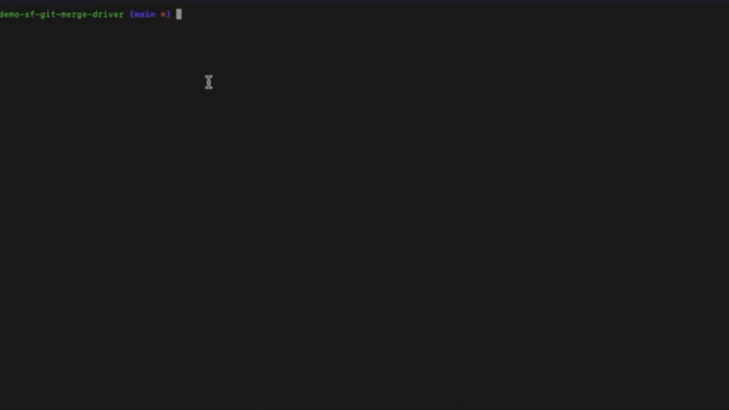
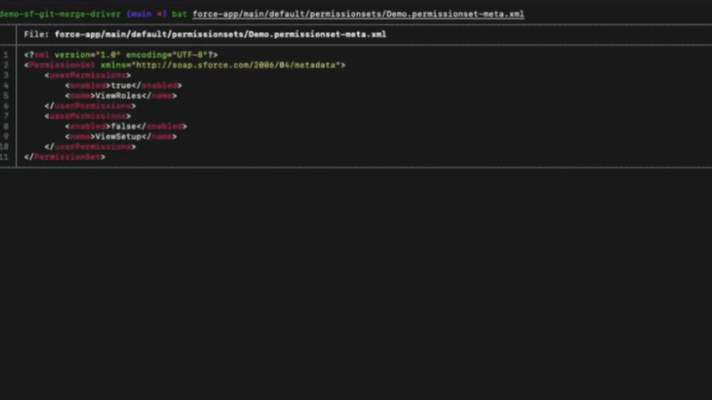
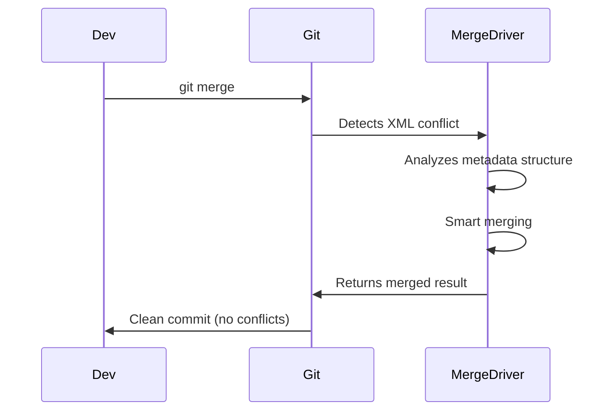

# Salesforce Metadata Git Merge Driver

[]()
[]()

An intelligent Git merge driver specifically designed for Salesforce metadata files. **Eliminates hours** of manual merge conflicts resolution.

## Demo

### Without sf-git-merge-driver


### With sf-git-merge-driver


## Why use this plugin?

- **Saves time**: No more manual XML conflict resolution
- **Zero-config**: Works immediately after installation
- **Reliable**: Understands Salesforce metadata structure
- **Transparent**: Seamless Git workflow integration

## How it works



## Conflict Style

This merge driver follows the **zdiff3** conflict style philosophy:

- **Shows the most compact diff possible**: Only the specific conflicting elements are marked, not entire file sections
- **Includes ancestor context**: Conflicts display the base (ancestor) version alongside local and remote changes
- **Respects Git configuration**: Conflict marker size and labels are configurable via Git's standard parameters (`-L`, `-S`, `-X`, `-Y` flags)

Example conflict output:
```xml
<<<<<<< ours
    <field>localValue</field>
||||||| base
    <field>originalValue</field>
=======
    <field>remoteValue</field>
>>>>>>> theirs
```

This approach helps you understand:
1. What the original value was (`base`)
2. What your branch changed it to (`ours`)
3. What the other branch changed it to (`theirs`)

## Installation (30 seconds)

### With Salesforce CLI

```bash
# Install plugin (one time, global)
sf plugins install sf-git-merge-driver

# Configure merge driver in your project (one time, local per project)
cd my/sf/project
sf git merge driver install
```

### Integration in VsCode SFDX-Hardis

[SFDX-Hardis VS Code extension](https://marketplace.visualstudio.com/items?itemName=NicolasVuillamy.vscode-sfdx-hardis) has integrated the sf-git-merge-driver in its default dependencies, and offers a one click activation of the merge driver from the status bar, as shown below:


## Usage

The merge driver activates **automatically** for conflicts on:
- [Full list of supported metadata](#configuration)

**No additional steps required!** Works during normal Git operations:
```bash
git pull  # Conflicts resolved automatically
git merge # Same here
```

## Configuration

Configured for these metadata files by default:
```gitattributes
*.profile-meta.xml merge=salesforce-source
*.permissionset-meta.xml merge=salesforce-source
*.labels-meta.xml merge=salesforce-source
*.label-meta.xml merge=salesforce-source
*.applicationVisibility-meta.xml merge=salesforce-source
*.classAccess-meta.xml merge=salesforce-source
*.customMetadataTypeAccess-meta.xml merge=salesforce-source
*.customPermission-meta.xml merge=salesforce-source
*.customSettingAccess-meta.xml merge=salesforce-source
*.externalCredentialPrincipalAccess-meta.xml merge=salesforce-source
*.externalDataSourceAccess-meta.xml merge=salesforce-source
*.fieldPermission-meta.xml merge=salesforce-source
*.flowAccess-meta.xml merge=salesforce-source
*.objectPermission-meta.xml merge=salesforce-source
*.pageAccess-meta.xml merge=salesforce-source
*.recordTypeVisibility-meta.xml merge=salesforce-source
*.tabSetting-meta.xml merge=salesforce-source
*.userPermission-meta.xml merge=salesforce-source
*.objectSettings-meta.xml merge=salesforce-source
*.permissionsetgroup-meta.xml merge=salesforce-source
*.permissionSetLicenseDefinition-meta.xml merge=salesforce-source
*.mutingpermissionset-meta.xml merge=salesforce-source
*.sharingRules-meta.xml merge=salesforce-source
*.sharingCriteriaRule-meta.xml merge=salesforce-source
*.sharingGuestRule-meta.xml merge=salesforce-source
*.sharingOwnerRule-meta.xml merge=salesforce-source
*.sharingTerritoryRule-meta.xml merge=salesforce-source
*.workflow-meta.xml merge=salesforce-source
*.workflowAlert-meta.xml merge=salesforce-source
*.workflowFieldUpdate-meta.xml merge=salesforce-source
*.workflowFlowAction-meta.xml merge=salesforce-source
*.workflowKnowledgePublish-meta.xml merge=salesforce-source
*.workflowOutboundMessage-meta.xml merge=salesforce-source
*.workflowRule-meta.xml merge=salesforce-source
*.workflowSend-meta.xml merge=salesforce-source
*.workflowTask-meta.xml merge=salesforce-source
*.assignmentRules-meta.xml merge=salesforce-source
*.autoResponseRules-meta.xml merge=salesforce-source
*.escalationRules-meta.xml merge=salesforce-source
*.marketingappextension-meta.xml merge=salesforce-source
*.matchingRule-meta.xml merge=salesforce-source
*.globalValueSet-meta.xml merge=salesforce-source
*.standardValueSet-meta.xml merge=salesforce-source
*.globalValueSetTranslation-meta.xml merge=salesforce-source
*.standardValueSetTranslation-meta.xml merge=salesforce-source
*.translation-meta.xml merge=salesforce-source
*.objectTranslation-meta.xml merge=salesforce-source
```

## How to disable it for a specific merge

When you don't want to use the merge driver for a specific merge, just backup the `.git/info/attributes` file and put it back after the merge.
```sh
mv .git/info/attributes .git/info/attributes.bak
git merge <branch>
mv .git/info/attributes.bak .git/info/attributes
```

If you want to disable the merge driver for a specific file, just comment the merge driver configuration from the `.git/info/attributes` file.
```sh
# *.profile-meta.xml merge=salesforce-source
```

If you want to disable it for all the project, just uninstall the driver: 
```sh
sf git merge driver uninstall
```

## How to know if it is installed and enabled ?

You can check if the merge driver is installed by running the following command:
```sh
git config --show-origin --get-regexp '^merge.salesforce-source(\..*)?'
```

You can check if the merge driver is enabled by running the following command:
```sh
grep "merge=salesforce-source" .git/info/attributes
```

## Behavior when the merge driver does not know the key

If the merge driver encounters a list of elements (like fields in a profile, or permissions in a permission set) but does not know which field acts as the "key" (unique identifier) for that type, it will fallback to standard conflict behavior.
This means you might see a conflict block containing the entire array instead of a smart merge of individual elements.

**If you encounter this behavior for a Salesforce metadata type the driver is supposed to handle, please open an issue!** We can add the missing key definition to support smart merging for that type.

**If you encounter this behavior for a Salesforce metadata type the driver does not already handle, please open an issue!** We can evaluate how to support smart merging for that type.

## Troubleshooting

The plugin uses the [Salesforce CLI logging system](https://developer.salesforce.com/docs/atlas.en-us.sfdx_setup.meta/sfdx_setup/sfdx_dev_cli_log_messages.htm) to log information.
You can control the logging level by setting the `SF_LOG_LEVEL` environment variable.
You can redirect the logging in the terminal using `DEBUG=sf-git-merge-driver`.

You can also use `GIT_TRACE=1` to get more information about git operations.
You can also use `GIT_MERGE_VERBOSITY=5` to get more information about the merge process.
Git environment variables are detailed [here](https://git-scm.com/book/en/v2/Git-Internals-Environment-Variables).

Example:

```sh
DEBUG=sf-git-merge-driver
SF_LOG_LEVEL=trace # can be error | warn | info | debug | trace, default: warn
GIT_MERGE_VERBOSITY=5 # can be 0 to 5
GIT_TRACE=true
git merge ...
```

## Commands

<!-- commands -->
* [`sf git merge driver disable`](#sf-git-merge-driver-disable)
* [`sf git merge driver enable`](#sf-git-merge-driver-enable)
* [`sf git merge driver install`](#sf-git-merge-driver-install)
* [`sf git merge driver run`](#sf-git-merge-driver-run)
* [`sf git merge driver uninstall`](#sf-git-merge-driver-uninstall)

## `sf git merge driver disable`

Uninstalls the local git merge driver for the given org and branch.

```
USAGE
  $ sf git merge driver disable [--json] [--flags-dir <value>]

GLOBAL FLAGS
  --flags-dir=<value>  Import flag values from a directory.
  --json               Format output as json.

DESCRIPTION
  Uninstalls the local git merge driver for the given org and branch.

  Uninstalls the local git merge driver for the given org and branch, by removing the merge driver content in the
  `.git/info/attributes` files in the project, deleting the merge driver configuration from the `.git/config` of the
  project, and removing the installed binary from the node_modules/.bin directory.

ALIASES
  $ sf git merge driver disable

EXAMPLES
  Uninstall the driver for a given project:

    $ sf git merge driver disable
```

## `sf git merge driver enable`

Installs a local git merge driver for the given org and branch.

```
USAGE
  $ sf git merge driver enable [--json] [--flags-dir <value>]

GLOBAL FLAGS
  --flags-dir=<value>  Import flag values from a directory.
  --json               Format output as json.

DESCRIPTION
  Installs a local git merge driver for the given org and branch.

  Installs a local git merge driver for the given org and branch, by updating the `.git/info/attributes` files in the
  project, creating a new merge driver configuration in the `.git/config` of the project, and installing the binary in
  the node_modules/.bin directory.

ALIASES
  $ sf git merge driver enable

EXAMPLES
  Install the driver for a given project:

    $ sf git merge driver enable
```

## `sf git merge driver install`

Installs a local git merge driver for the given org and branch.

```
USAGE
  $ sf git merge driver install [--json] [--flags-dir <value>]

GLOBAL FLAGS
  --flags-dir=<value>  Import flag values from a directory.
  --json               Format output as json.

DESCRIPTION
  Installs a local git merge driver for the given org and branch.

  Installs a local git merge driver for the given org and branch, by updating the `.git/info/attributes` files in the
  project, creating a new merge driver configuration in the `.git/config` of the project, and installing the binary in
  the node_modules/.bin directory.

ALIASES
  $ sf git merge driver enable

EXAMPLES
  Install the driver for a given project:

    $ sf git merge driver install
```

_See code: [src/commands/git/merge/driver/install.ts](https://github.com/scolladon/sf-git-merge-driver/blob/main/src/commands/git/merge/driver/install.ts)_

## `sf git merge driver run`

Runs the merge driver for the specified files.

```
USAGE
  $ sf git merge driver run -O <value> -A <value> -B <value> -P <value> [--json] [--flags-dir <value>] [-L <value>] [-S
    <value>] [-X <value>] [-Y <value>]

FLAGS
  -A, --local-file=<value>             (required) path to our version of the file
  -B, --other-file=<value>             (required) path to their version of the file
  -L, --conflict-marker-size=<value>   [default: 7] number of characters to show for conflict markers
  -O, --ancestor-file=<value>          (required) path to the common ancestor version of the file
  -P, --output-file=<value>            (required) path to the file where the merged content will be written
  -S, --ancestor-conflict-tag=<value>  [default: base] string used to tag ancestor version in conflicts
  -X, --local-conflict-tag=<value>     [default: ours] string used to tag local version in conflicts
  -Y, --other-conflict-tag=<value>     [default: theirs] string used to tag other version in conflicts

GLOBAL FLAGS
  --flags-dir=<value>  Import flag values from a directory.
  --json               Format output as json.

DESCRIPTION
  Runs the merge driver for the specified files.

  Runs the merge driver for the specified files, handling the merge conflict resolution using Salesforce-specific merge
  strategies. This command is typically called automatically by Git when a merge conflict is detected.

EXAMPLES
  Run the merge driver for conflicting files:

    $ sf git merge driver run --ancestor-file=<value> --local-file=<value> --other-file=<value> ^
      --output-file=<value>

  Where:
  - ancestor-file is the path to the common ancestor version of the file
  - local-file is the path to our version of the file
  - other-file is the path to their version of the file
  - output-file is the path to the file where the merged content will be written
```

_See code: [src/commands/git/merge/driver/run.ts](https://github.com/scolladon/sf-git-merge-driver/blob/v1.3.0/src/commands/git/merge/driver/run.ts)_

## `sf git merge driver uninstall`

Uninstalls the local git merge driver for the given org and branch.

```
USAGE
  $ sf git merge driver uninstall [--json] [--flags-dir <value>]

GLOBAL FLAGS
  --flags-dir=<value>  Import flag values from a directory.
  --json               Format output as json.

DESCRIPTION
  Uninstalls the local git merge driver for the given org and branch.

  Uninstalls the local git merge driver for the given org and branch, by removing the merge driver content in the
  `.git/info/attributes` files in the project, deleting the merge driver configuration from the `.git/config` of the
  project, and removing the installed binary from the node_modules/.bin directory.

ALIASES
  $ sf git merge driver disable

EXAMPLES
  Uninstall the driver for a given project:

    $ sf git merge driver uninstall
```

_See code: [src/commands/git/merge/driver/uninstall.ts](https://github.com/scolladon/sf-git-merge-driver/blob/v1.3.0/src/commands/git/merge/driver/uninstall.ts)_
<!-- commandsstop -->
* [`sf git merge driver disable`](#sf-git-merge-driver-disable)
* [`sf git merge driver enable`](#sf-git-merge-driver-enable)
* [`sf git merge driver install`](#sf-git-merge-driver-install)
* [`sf git merge driver run`](#sf-git-merge-driver-run)
* [`sf git merge driver uninstall`](#sf-git-merge-driver-uninstall)

## `sf git merge driver disable`

Uninstalls the local git merge driver for the given org and branch.

```
USAGE
  $ sf git merge driver disable [--json] [--flags-dir <value>]

GLOBAL FLAGS
  --flags-dir=<value>  Import flag values from a directory.
  --json               Format output as json.

DESCRIPTION
  Uninstalls the local git merge driver for the given org and branch.

  Uninstalls the local git merge driver for the given org and branch, by removing the merge driver content in the
  `.git/info/attributes` files in the project, deleting the merge driver configuration from the `.git/config` of the
  project, and removing the installed binary from the node_modules/.bin directory.

ALIASES
  $ sf git merge driver disable

EXAMPLES
  Uninstall the driver for a given project:

    $ sf git merge driver disable
```

## `sf git merge driver enable`

Installs a local git merge driver for the given org and branch.

```
USAGE
  $ sf git merge driver enable [--json] [--flags-dir <value>]

GLOBAL FLAGS
  --flags-dir=<value>  Import flag values from a directory.
  --json               Format output as json.

DESCRIPTION
  Installs a local git merge driver for the given org and branch.

  Installs a local git merge driver for the given org and branch, by updating the `.git/info/attributes` files in the
  project, creating a new merge driver configuration in the `.git/config` of the project, and installing the binary in
  the node_modules/.bin directory.

ALIASES
  $ sf git merge driver enable

EXAMPLES
  Install the driver for a given project:

    $ sf git merge driver enable
```

## `sf git merge driver install`

Installs a local git merge driver for the given org and branch.

```
USAGE
  $ sf git merge driver install [--json] [--flags-dir <value>]

GLOBAL FLAGS
  --flags-dir=<value>  Import flag values from a directory.
  --json               Format output as json.

DESCRIPTION
  Installs a local git merge driver for the given org and branch.

  Installs a local git merge driver for the given org and branch, by updating the `.git/info/attributes` files in the
  project, creating a new merge driver configuration in the `.git/config` of the project, and installing the binary in
  the node_modules/.bin directory.

ALIASES
  $ sf git merge driver enable

EXAMPLES
  Install the driver for a given project:

    $ sf git merge driver install
```

_See code: [src/commands/git/merge/driver/install.ts](https://github.com/scolladon/sf-git-merge-driver/blob/v1.3.0/src/commands/git/merge/driver/install.ts)_

## `sf git merge driver run`

Runs the merge driver for the specified files.

```
USAGE
  $ sf git merge driver run -O <value> -A <value> -B <value> -P <value> [--json] [--flags-dir <value>] [-L <value>] [-S
    <value>] [-X <value>] [-Y <value>]

FLAGS
  -A, --local-file=<value>             (required) path to our version of the file
  -B, --other-file=<value>             (required) path to their version of the file
  -L, --conflict-marker-size=<value>   [default: 7] number of characters to show for conflict markers
  -O, --ancestor-file=<value>          (required) path to the common ancestor version of the file
  -P, --output-file=<value>            (required) path to the file where the merged content will be written
  -S, --ancestor-conflict-tag=<value>  [default: BASE] string used to tag ancestor version in conflicts
  -X, --local-conflict-tag=<value>     [default: LOCAL] string used to tag local version in conflicts
  -Y, --other-conflict-tag=<value>     [default: REMOTE] string used to tag other version in conflicts

GLOBAL FLAGS
  --flags-dir=<value>  Import flag values from a directory.
  --json               Format output as json.

DESCRIPTION
  Runs the merge driver for the specified files.

  Runs the merge driver for the specified files, handling the merge conflict resolution using Salesforce-specific merge
  strategies. This command is typically called automatically by Git when a merge conflict is detected.

EXAMPLES
  Run the merge driver for conflicting files:

    $ sf git merge driver run --ancestor-file=<value> --local-file=<value> --other-file=<value> \
      --output-file=<value>

  Where:
  - ancestor-file is the path to the common ancestor version of the file
  - local-file is the path to our version of the file
  - other-file is the path to their version of the file
  - output-file is the path to the file where the merged content will be written
```

_See code: [src/commands/git/merge/driver/run.ts](https://github.com/scolladon/sf-git-merge-driver/blob/main/src/commands/git/merge/driver/run.ts)_

## `sf git merge driver uninstall`

Uninstalls the local git merge driver for the given org and branch.

```
USAGE
  $ sf git merge driver uninstall [--json] [--flags-dir <value>]

GLOBAL FLAGS
  --flags-dir=<value>  Import flag values from a directory.
  --json               Format output as json.

DESCRIPTION
  Uninstalls the local git merge driver for the given org and branch.

  Uninstalls the local git merge driver for the given org and branch, by removing the merge driver content in the
  `.git/info/attributes` files in the project, deleting the merge driver configuration from the `.git/config` of the
  project, and removing the installed binary from the node_modules/.bin directory.

ALIASES
  $ sf git merge driver disable

EXAMPLES
  Uninstall the driver for a given project:

    $ sf git merge driver uninstall
```

_See code: [src/commands/git/merge/driver/uninstall.ts](https://github.com/scolladon/sf-git-merge-driver/blob/main/src/commands/git/merge/driver/uninstall.ts)_
<!-- commandsstop -->
## Changelog

[changelog.md](CHANGELOG.md) is available for consultation.

## Versioning

Versioning follows [SemVer](http://semver.org/) specification.

## Authors

- **Kevin Gossent** - [yohanim](https://github.com/yohanim)
- **Sebastien Colladon** - [scolladon](https://github.com/scolladon)

## Contributing

Contributions are what make the trailblazer community such an amazing place. We regard this component as a way to inspire and learn from others. Any contributions you make are **appreciated**.

See [contributing.md](CONTRIBUTING.md) for sgd contribution principles.

## License

This project license is MIT - see the [LICENSE.md](LICENSE.md) file for details
