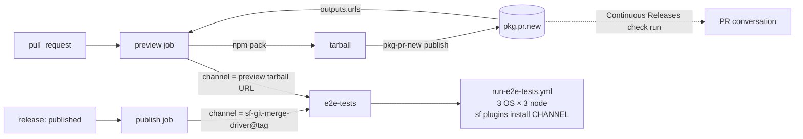

# Design — pkg.pr.new PR previews

> Brief: replace the per-PR draft GitHub prerelease dev-build flow with pkg.pr.new
> preview publishing in `.github/workflows/npm-service.yml`.
> Status: draft → self-reviewed ×3

## Context

### What exists today

`.github/workflows/npm-service.yml` is triggered by `release: [published]` and by
`pull_request` on `main` (`opened, synchronize, reopened, closed`,
`paths-ignore: **.md`). The workflow default is `permissions: contents: read`; jobs
escalate explicitly. It holds four jobs.

| Job | Trigger slice | Permissions | What it does |
|---|---|---|---|
| `publish` | `release` | `id-token: write`, `contents: read` | `npm publish --provenance --access public --tag latest-rc`; emits `channel=sf-git-merge-driver@<tag>` |
| `dev-release` | `pull_request`, not `closed`, not dependabot | `contents: write`, `pull-requests: write` | `npm run build` + `npm pack`, renames the tarball to `sf-git-merge-driver-dev-pr-<N>.tgz`, creates or updates a GitHub prerelease tagged `dev-pr-<N>` via `gh release create`/`gh release upload --clobber`, reads the asset URL back as `channel`, posts a PR comment (`thollander/actions-comment-pull-request@v3`, `comment-tag: dev-publish`, `mode: recreate`) carrying `sf plugins install <asset url>` |
| `cleanup` | `pull_request` `closed`, not dependabot | `contents: write` | `gh release delete "dev-pr-<N>" --yes --cleanup-tag` |
| `e2e-tests` | always evaluated | inherited | `needs: [publish, dev-release]`, gated on `!cancelled() && (publish.result == 'success' \|\| dev-release.result == 'success')`, calls `./.github/workflows/run-e2e-tests.yml` with `channel: needs.publish.outputs.channel \|\| needs.dev-release.outputs.channel` |

`run-e2e-tests.yml` takes a single `channel` string (default `latest-rc`), runs a
macos/windows/ubuntu × node 22/24/26 matrix, checks out ref `e2e/base`, installs
`@salesforce/cli`, then `echo y | sf plugins install "$CHANNEL"`,
`sf git merge driver --help`, `npm run test:e2e`, `npm run validate`.

### What that costs

Three problems, all structural rather than incidental.

1. **A PR-triggered job holds `contents: write`.** `dev-release` and `cleanup` can
   write tags and releases on the repository, from a workflow whose trigger is a
   pull request. That is the largest privilege in the repository's CI surface and it
   exists only to stage a throwaway tarball.
2. **Fork PRs get nothing.** For `pull_request` events raised from a fork, GitHub
   issues a read-only `GITHUB_TOKEN` regardless of the `permissions:` block, so
   `gh release create` fails with 403. `dev-release` therefore goes red for every
   external contributor and, because `e2e-tests` requires
   `dev-release.result == 'success'`, the whole cross-platform e2e matrix is skipped
   for them.
3. **Releases and tags accumulate.** Cleanup only fires on `pull_request: closed`; a
   failed or skipped cleanup leaves a `dev-pr-<N>` release *and* a `dev-pr-<N>` git
   tag behind. Two are live right now — `dev-pr-205` and `dev-pr-207`, both for
   currently-open PRs. Once `cleanup` is deleted, nothing will reap them.

### Patterns this change must follow

Established in `.github/`, verified in the worktree:

- `actions/checkout@v7` with `persist-credentials: false`.
- `./.github/actions/install` is the shared setup composite (npm cache via
  `actions/cache@v6`, then `npm ci` with `HUSKY: '0'`).
- Actions are pinned to **version tags, never commit SHAs**; `.github/zizmor.yml`
  relaxes `unpinned-uses` to `ref-pin` precisely to allow that, and Dependabot keeps
  the tags current.
- Fork detection, where it is needed, uses
  `github.event.pull_request.head.repo.full_name == github.repository` — already the
  idiom in the `commit-lint` job of `.github/workflows/on-pull-request.yml`.
- MegaLinter (`oxsecurity/megalinter/flavors/javascript@v9`, `VALIDATE_ALL_CODEBASE:
  true`) lints the whole tree, YAML and Markdown included, with cspell and lychee
  active.
- Workflow-level and job-level `permissions:` blocks carry an explanatory comment.

There are no prior ADRs and no `docs/design/` tree; this is the first document in it.

## Requirements

Each of these is checkable against the resulting workflow file or against a real PR run.

| # | Requirement |
|---|---|
| R1 | No job reachable from a `pull_request` trigger in `npm-service.yml` declares `contents: write`. |
| R2 | No workflow in the repository creates, updates or deletes a GitHub release or a git tag whose name matches `dev-pr-*`. (Release-please and `on-published-release.yml` keep managing real release tags; only the `dev-pr-*` namespace disappears.) |
| R3 | The `cleanup` job is deleted, and `closed` is removed from the workflow's `pull_request` `types` list, because nothing consumes that event any more. |
| R4 | `e2e-tests` receives a non-empty channel on both paths: `sf-git-merge-driver@<tag>` on `release`, and a single pkg.pr.new tarball URL on `pull_request`. |
| R5 | The preview job fails if the URL it produces is empty or contains more than one URL, rather than handing `run-e2e-tests.yml` a malformed channel — see the silent-fallback trap below. |
| R6 | `run-e2e-tests.yml` is not modified. |
| R7 | The `publish` job is byte-identical to its current form. |
| R8 | Dependabot-authored PRs still skip preview publishing, and therefore still skip `e2e-tests`. |
| R9 | A PR raised from a fork publishes a preview successfully and runs the full `e2e-tests` matrix — i.e. the flow requires no write-scoped `GITHUB_TOKEN`. |
| R10 | The artifact published as a preview is the same tarball `npm publish` would ship for that commit — same `prepack`, same `files` set, no repack. |
| R11 | `actionlint` and `zizmor@1.25.0` (under `.github/zizmor.yml`) report no findings on the resulting file, and the change introduces **no new suppression directive** of any kind — no `# zizmor: ignore`, no rule disabled, no lint-silencing comment. (Adding a proper noun to the cspell project dictionary is not in this class: it teaches the checker a word rather than switching the check off.) |

## Design

### Pinned behaviour matrix

Everything below was established empirically in this session against the live
service and against `pkg-pr-new@0.0.86` (current `latest`), not from memory. Line
references are into the published CLI bundle
(`node_modules/pkg-pr-new/dist/index.js`) and into `stackblitz-labs/pkg.pr.new@main`.

| # | Question | Probe | Result |
|---|---|---|---|
| P1 | Does the CLI need a secret? | CLI bundle L32356-32384 | No. It hashes `{owner, repo, GITHUB_RUN_ID, GITHUB_RUN_ATTEMPT, GITHUB_ACTOR_ID}` and posts that to `/check`; the server authenticates the run through the GitHub App. No `GITHUB_TOKEN` is read. Hence fork PRs work. |
| P2 | Is the compact URL form whitelist-gated? | `packages/utils/index.ts` `isWhitelisted`, plus its only two call sites | **No.** The whitelist gates exactly two things: payloads above 120 MB (`routes/publish.post.ts`) and multipart uploads (`routes/multipart/create.post.ts`). It has nothing to do with URL shape. |
| P3 | Does a compact URL resolve for this package? | `curl -D- 'https://pkg.pr.new/sf-git-merge-driver@0123…4567'` | HTTP 404 with body `Pkg not found` and header `x-commit-key: scolladon:sf-git-merge-driver:0123…4567`. Owner/repo resolution **succeeded**. Control probe with a bogus package name returns `Registry or repository not found`. |
| P4 | Why does P3 resolve? | `server/middleware/tarball-resolver.ts` | For a single-segment compact path the server resolves owner/repo from the npm registry manifest's `repository` field. `sf-git-merge-driver@1.9.1` is on npm with `repository: git+https://github.com/scolladon/sf-git-merge-driver.git`, so it resolves to `scolladon/sf-git-merge-driver`. |
| P5 | So which URL form will the CLI emit? | CLI L32298, L32496-32552 | **Compact.** `isCompact` defaults to true; the only client-side gate (`verifyCompactMode`) requires the package to be on npm with an extractable `repository` — both hold. Expect `pkg.pr.new/sf-git-merge-driver@<short-sha>`, 7-char sha (`commitLength = 7`, L30576). If compact ever became unavailable the CLI logs `Falling back to non-compact URLs for this run` and emits the long `pkg.pr.new/<owner>/<repo>/<pkg>@<full-sha>` form instead — both shapes are valid inputs. |
| P6 | What lands in `$GITHUB_OUTPUT`? | CLI L32867-32884 | `commentId` (only when a comment was posted), then `sha=<formattedSha>`, `urls=<space-separated urls>`, `packages=<space-separated name@url>`. |
| P7 | Is a prebuilt tarball repacked? | CLI L32277-32291, L32418-32451 | No. A `.tgz`/`.tar.gz` argument switches the CLI into tarball mode; it reads the top-level `package.json` out of the tarball and uploads the file as-is. Directory and tarball inputs cannot be mixed (exit 1). `--previewVersion` is rejected in tarball mode (exit 1) and is not needed here. |
| P8 | Is the payload within limits? | `npm view sf-git-merge-driver dist` | `unpackedSize` 892 864 B across 169 files; the gzipped tarball is far below the 120 MB non-whitelisted cap. |
| P9 | Can `sf plugins install` take such a URL? | Pinned earlier this session against a real oclif plugin tarball served at `http://localhost:8787/scolladon/sfdx-git-delta@abc1234` | Yes. `@oclif/plugin-plugins` routes any `:`-containing argument to `npm install <url>` and recovers the plugin name from the recorded remote dependency via `npm-package-arg`. The compact form differs only by having one fewer path segment; the `@`-in-path shape is identical. |
| P10 | What does the App's own comment say? | `server/utils/markdown.ts` | `npm i <url>` (or `npx <url>` under `--bin`). Neither is correct for an `sf` plugin, and the text is not customizable — `--comment` only accepts `off\|create\|update`. |
| P11 | Is anything published outside the comment? | `routes/publish.post.ts` L244-284 | Yes, and unconditionally: a **`Continuous Releases` check run** is created on the head sha, whose output body carries the sha install URLs. It is emitted regardless of `--comment`, so `--comment=off` still leaves the preview URL discoverable on the PR. |
| P12 | Is there a rolling per-PR URL? | `routes/publish.post.ts` L112-228, resolver middleware | Yes. The server keeps a cursor `owner:repo:<ref>` → latest sha, so `pkg.pr.new/sf-git-merge-driver@<pr-number>` follows the PR head. Cursor writes are guarded by `isStaleCursor` on the run id, so a cancelled-then-superseded run cannot regress it. |
| P13 | Which sha ends up in the URL? | CLI L32385-32394 | On `pull_request` the sha comes from the server's workflow record; on other events the CLI overrides it with `git rev-parse HEAD`. The storage key and the URL are both built from that same `workflowData.sha`, so the URL is self-consistent by construction and the workflow never computes a sha itself. |
| P14 | How long do previews live? | `stackblitz-labs/pkg.pr.new` README (29 537 B, grepped) | **Undocumented.** No retention window is stated upstream; the server tracks a `downloadedAt` per object, which implies eventual reclamation. Treat preview URLs as transient. |

### Failure semantics

Every CLI failure path is a `process.exit(1)` — the step goes red, the job goes red,
and `e2e-tests` is skipped because neither `publish` nor `preview` reports `success`.

| Condition | Observable | Acceptable? |
|---|---|---|
| GitHub App not installed on the repo | `Check failed (404): {…"message":"The app https://github.com/apps/pkg-pr-new is not installed on scolladon/sf-git-merge-driver."}` (CLI L32378-32384) | Yes — loud and self-describing. It is a one-time prerequisite; the error names the exact remedy. |
| Service unreachable | `Failed to connect to server: <error>` (L32374-32377), after the CLI's internal 5xx retry loop | Yes. Same blast radius as today's `gh release create` failing: preview red, e2e skipped, no other job affected. |
| Service returns non-2xx on publish | `Publishing failed (<status>): <body>` (L32822-32826) | Yes, same as above. |
| Workflow record not yet registered (webhook race) | `Check failed (404): There is no workflow defined for <key>` | Yes — a re-run resolves it. |
| Run outside GitHub Actions | `Continuous Releases are only available in GitHub Actions.` | Yes; makes the job non-reproducible locally by construction, which is inherent to the tool. |

The net availability change is a swap of one third-party dependency for another:
today a preview depends on the GitHub Releases API accepting a write; tomorrow it
depends on `pkg.pr.new` being up. Neither can block `publish`, `build`,
`megalinter` or any other CI job.

### Target workflow shape

`publish` and `e2e-tests`'s reusable-workflow call are unchanged except that
`dev-release` is renamed to `preview` in `needs` and in the channel expression.

The block below is **abridged**, not ready to paste: bodies of unchanged jobs and of
the new job's steps are replaced by comments so the structure stays readable.

```yaml
on:
  release:
    types: [published]
  pull_request:
    branches: [main]
    types: [opened, synchronize, reopened]   # `closed` dropped with `cleanup`
    paths-ignore:
      - "**.md"

permissions:
  contents: read

jobs:
  publish:        # unchanged, release-only
  preview:
    if: >-
      github.event_name == 'pull_request' &&
      github.actor != 'dependabot[bot]'
    runs-on: ubuntu-latest
    outputs:
      channel: ${{ steps.preview.outputs.urls }}
    permissions:
      contents: read
      pull-requests: write   # only if the workflow posts its own comment
    steps:
      - uses: actions/checkout@v7
        with:
          persist-credentials: false
      - uses: actions/setup-node@v7
        with:
          node-version: 22
          package-manager-cache: false
      - uses: ./.github/actions/install
      - name: Build and pack        # derives the tarball name from package.json
      - name: Publish preview       # id: preview — pkg-pr-new publish "./$TARBALL"
      - name: Comment PR            # gated on same-repo, if we post our own
  e2e-tests:
    needs: [publish, preview]
    if: "!cancelled() && (needs.publish.result == 'success' || needs.preview.result == 'success')"
    uses: ./.github/workflows/run-e2e-tests.yml
    with:
      channel: ${{ needs.publish.outputs.channel || needs.preview.outputs.channel }}
```

Notes on the non-obvious parts:

- **`package-manager-cache: false` is load-bearing, and it is a fix rather than a
  silencer.** `actions/setup-node@v7` enables package-manager caching by default
  (`package-manager-cache` defaults to `true` in its `action.yml`), and zizmor's
  `cache-poisoning` audit flags any `setup-node` in a workflow it classifies as a
  publisher — which this workflow is, via its `release` trigger. Verified: adding the
  `preview` job without this input produces `error[cache-poisoning] … high` and fails
  the gate; with it, zizmor reports *no findings*. The input is also honest — the npm
  cache is already restored by `./.github/actions/install` via `actions/cache@v6`, so
  setup-node's implicit cache is redundant. This satisfies R11 without adding a
  `# zizmor: ignore[...]` comment. The two pre-existing suppressions elsewhere in the
  file are left untouched.
- **Channel extraction, and the silent-fallback trap it guards.**
  `steps.preview.outputs.urls` is a space-separated list. This is a single-package
  repository, so it is exactly one URL — but R5 requires the job to assert that
  (non-empty, no embedded space) and fail loudly otherwise. The reason is specific
  and nasty: `run-e2e-tests.yml` declares `channel` with `default: latest-rc`. If
  `preview` succeeds while emitting an empty `urls`, the `channel` expression
  collapses to `''`, the reusable workflow substitutes its default, and the whole
  nine-cell matrix goes **green while testing the last published release instead of
  the PR build**. A green e2e that proves nothing is worse than a red one. The assert
  is the only thing standing between the two.
- **Which URL to hand to e2e.** The sha-pinned URL from `urls`, not the rolling
  `@<pr-number>` alias: e2e must install exactly the build that this run produced,
  and the alias is mutable under concurrent runs.
- **`npm run build` before `npm pack`** stays. It is technically redundant — `npm
  pack` triggers `prepack`, which wireit resolves to `build` + `build:bin` — but it
  keeps compile/lint failures reported as their own step, and the second invocation
  is a wireit cache hit.
- **Concurrency** is unchanged (`${{ github.ref }}-${{ github.workflow }}`,
  `cancel-in-progress: true`). Superseded preview runs are safe: the server's
  `isStaleCursor` check is keyed on run id (P12).
- **Job-level `permissions:` replaces the workflow default, it does not merge with
  it.** So `contents: read` must be listed explicitly on `preview` alongside anything
  else it needs. If D1 lands on the App-comment option, the job needs nothing beyond
  `contents: read` and the block can be dropped entirely in favour of the inherited
  default.
- **`paths-ignore: "**.md"` is retained**, which means a markdown-only PR triggers no
  preview and no e2e — unchanged from today, but a trap worth naming, because this
  very change is partly documentation. It only self-tests because the same PR also
  edits `.github/workflows/npm-service.yml`.
- **Preview tarballs carry the released version number.** `package.json` says
  `1.9.1` and the tarball is taken as-is, so a reviewer who installs a preview sees
  `1.9.1` in `sf plugins` — indistinguishable from the published release by version
  string alone. This is true of the current `dev-pr-<N>` flow too, so it is not a
  regression, but see D3: it is the one thing the source-directory alternative could
  fix.

### Channel flow



### Fork PRs

This is where behaviour improves. Because authentication is App-mediated and no
`GITHUB_TOKEN` write scope is consulted (P1), a fork PR publishes a preview exactly
like an internal one, and `e2e-tests` therefore runs for external contributors for
the first time. `GITHUB_REPOSITORY` on a `pull_request` event is the *base*
repository, so the App installation on `scolladon/sf-git-merge-driver` is the one
that authenticates — no installation on the fork is required.

The one thing a fork PR still cannot do is have the *workflow* post a comment, since
its token is read-only. Whether that matters depends on the comment decision below;
either way the preview URL remains visible on the PR via the `Continuous Releases`
check run (P11) and in the job log.

There is a cost to name plainly, because it is the flip side of the benefit: making
fork PRs work means fork-authored code now gets built, packed, published to a public
URL, and then **executed on nine runners** by the e2e matrix. Today that path is shut
because `dev-release` 403s. Two things bound it. First, this is not a new class of
exposure — `on-pull-request.yml` already runs `npm ci` and the full test suite on
fork-authored code via `reusable-build.yml`, so arbitrary fork code already executes
in this repository's CI. Second, the standard control applies unchanged: GitHub's
*Require approval for all external contributors* setting on the repository gates
every fork-PR workflow run behind a maintainer click. Confirm that setting is on
before merging; it is the mechanism this change leans on, and it is repository
configuration rather than anything expressible in the workflow file.

### Surfaces touched

- `.github/workflows/npm-service.yml` — the whole change.
- `CONTRIBUTING.md` — verified: it does **not** mention `dev-pr-*` or the dev-build
  flow. Its only install reference is line 306, `sf plugins install
  sf-git-merge-driver@<beta-channel>`, which is about published beta channels and is
  unaffected. No edit is required; a short "how to try a PR build" note would be a
  documentation-phase addition, not a correction.
- `.github/linters/.cspell.json` — already amended alongside this document with the
  two proper nouns it needs (`stackblitz`, `tsgit`), following the existing precedent
  in that list for vendor and author names. Implementation may need one or two more
  if the new workflow comments introduce unknown tokens.
- Repository state (releases `dev-pr-205`, `dev-pr-207` and their tags) — see the
  decision candidates; nothing in the change touches them automatically.

## Decision candidates

| # | Choice | Alternatives (≤3) | Recommendation | Why |
|---|---|---|---|---|
| D1 | PR comment strategy | **(a)** App comment only (`--comment=update`); **(b)** `--comment=off` + workflow-authored comment reusing `thollander/actions-comment-pull-request@v3` with `comment-tag: dev-publish`, gated on `head.repo.full_name == github.repository`; **(c)** both — App comment everywhere plus a same-repo-only corrected comment | **(b)** | The comment's only job is to tell a reviewer how to try the build. The App's text is `npm i <url>` (P10), which is simply the wrong command for an `sf` plugin and cannot be customized — a confidently wrong instruction is worse than none. (b) preserves today's exact UX and reuses an action already in the file. Its cost — fork PRs get no *comment* — is much smaller than it first appears, because the `Continuous Releases` check run carries the URL regardless (P11), and fork PRs newly gain the thing that actually matters: a working preview and a green e2e matrix. (c) puts two comments on every internal PR, which is the common case. The counter-argument for (a) is real and worth weighing: it needs zero extra permissions, dropping `pull-requests: write` from the job as well as `contents: write`. |
| D2 | Publish previews on pushes to `main` too | **(a)** PR only, as today; **(b)** add `push: [main]`, as `scolladon/tsgit` does, and let `e2e-tests` run on it as a third path; **(c)** add `push: [main]` for the preview only, leaving `e2e-tests` gated to the PR and release paths | **(a)** | A trunk preview is useful for installing `main` between releases, but `main` here is release-please-managed and a real `latest-rc` publish follows quickly, so the window it covers is thin. (b) is the costly one: `e2e-tests`'s `if:` and `channel:` expressions are currently keyed to exactly two mutually-exclusive event paths, and a third path means reworking both — nine more matrix cells per merge for no named consumer. (c) avoids that cost but produces preview URLs nothing verifies, which is a worse property than not having them. Keep (a); (c) becomes attractive the moment someone actually asks to install trunk. |
| D3 | What to publish | **(a)** prebuilt tarball: `npm pack` then `pkg-pr-new publish "./$TARBALL"`; **(b)** source directory: bare `pkg-pr-new publish`, letting the CLI run `npm pack --json` itself; **(c)** source directory plus `--previewVersion` | **(a)** | Both (a) and (b) run `prepack` (hence `build`, `build:bin`, `oclif manifest`, `oclif readme`), so the contents are equivalent. (a) is preferred because the artifact is byte-identical to what `npm publish` would ship (R10) and the pack step stays visible and independently debuggable in the job log rather than happening inside a third-party CLI. The honest cost: (a) forfeits `--previewVersion`, which is rejected in tarball mode (P7), so every preview reports version `1.9.1` — that is the argument for (c), and it is a real one if version confusion is judged a live risk. It is not a *new* risk, though: the current `dev-pr-<N>` tarballs already carry the released version. Workspace-dependency rewriting, the other thing (a) forfeits, is a monorepo feature this single-package repo cannot use. |
| D4 | Existing `dev-pr-205` / `dev-pr-207` releases and tags | **(a)** delete both releases and their tags by hand at merge time, not on this branch; **(b)** leave them and let a maintainer reap them whenever; **(c)** keep `cleanup` alive as a `pull_request: closed`-only job purely to drain the backlog, delete it in a follow-up | **(a)** | Both PRs are still open, so both releases are currently *in use* — deleting today breaks a live install link, which is why (a) is scheduled for merge time rather than now. After this ships they stop being refreshed, go stale on the next push to those PRs, and nothing will ever reap them; a note left on both PRs pointing at the new preview URL closes the loop. (c) directly contradicts R1/R2 by keeping a `contents: write` job on a PR trigger, which is the whole point of the change. (b) is acceptable but leaves two misleading prerelease entries on the releases page indefinitely. |
| D5 | How to pin `pkg-pr-new` | **(a)** `npx --yes pkg-pr-new@0.0.86` — exact version, bumped by hand; **(b)** `npx pkg-pr-new` floating on `latest`, as `scolladon/tsgit` does; **(c)** add `pkg-pr-new` as a `devDependency` so Dependabot and the lockfile own the version | **(c)** | This repository pins every action to a tag and lets Dependabot move it (`.github/zizmor.yml` `ref-pin` policy exists specifically to encode that stance). An unpinned `npx` on every PR run is the one place that stance would be abandoned, and it fetches a third-party CLI that reads repository metadata. (c) is the closest fit to the house rule: exact version in `package-lock.json`, integrity-checked, Dependabot-maintained, and `npm ci` already runs in the job. Its cost is one more devDependency in a repo that runs `npm run lint:dependencies` — knip must be told the binary is used from CI, or the check will report it unused, which is the specific thing to verify before committing to (c). (a) is the zero-friction fallback with the same pinning property but manual bumps. |

## Test strategy

There is no unit-test surface here — this is CI YAML, and honesty about that is more
useful than inventing one. What actually proves the change, in the order it should
be run:

**Static, locally, before pushing.** All three are already installed or trivially
available, and all three were exercised against a draft of the target file during
this design:

- `actionlint .github/workflows/npm-service.yml` — expression syntax, `needs`
  references, context availability, shell parsing. Clean on the draft.
- `uvx zizmor@1.25.0 --offline --config .github/zizmor.yml
  .github/workflows/npm-service.yml` — must report *no findings*. This is the gate
  that caught `cache-poisoning` on the new `setup-node` and drove
  `package-manager-cache: false`. Baseline for comparison: the current file reports
  `No findings (2 ignored, …)`. The target must report `No findings` with the
  `ignored` count down to **1** — the `dev-release` job's suppression leaves with the
  job, and the new job adds none. That count is the mechanical expression of R11.
- MegaLinter locally, or at least its YAML/cspell/lychee subset, since it runs with
  `VALIDATE_ALL_CODEBASE: true` and will lint this design document as well as the
  workflow.

**Semantic review of the diff.** A reviewer should specifically confirm:

1. `grep -n 'contents: write' .github/workflows/npm-service.yml` returns nothing
   (R1).
2. `grep -rn 'dev-pr' .github/` returns nothing (R2).
3. The `cleanup` job is gone *and* `closed` is gone from `types:` — one without the
   other leaves a trigger that starts a workflow which does nothing (R3).
4. `publish` is untouched: same steps, same `id-token: write`, same
   `--tag latest-rc`, same `channel` expression (R7).
5. `run-e2e-tests.yml` is absent from the diff (R6).
6. `needs:`, the `if:` result-check, and the `channel:` expression in `e2e-tests` all
   name the *same* renamed job. A rename applied to two of the three yields a
   silently skipped e2e matrix, which is the most likely mistake in this change.
7. `github.actor != 'dependabot[bot]'` survived the `if:` rewrite (R8).
8. No new `# zizmor: ignore` or any other lint-silencing comment (R11).

**The real proof is the first PR that runs it — this one.** No amount of static
checking substitutes; check on the PR:

- The `preview` job is green and the log shows `npm notice … .tgz` from pack, then a
  pkg.pr.new URL. Confirm the URL shape matches P5 (compact,
  `pkg.pr.new/sf-git-merge-driver@` + 7 hex).
- A `Continuous Releases` check run appears on the PR (P11) — this is the signal that
  the GitHub App is installed and authenticated. Its absence, together with a
  `Check failed (404)` in the log, is the App-not-installed diagnosis.
- The `e2e-tests` matrix runs all nine cells and each `sf plugins install "$CHANNEL"`
  succeeds — this is the single most important assertion in the whole change. P9
  pinned installability by proxy, against a stand-in tarball on a local server; this
  is the only end-to-end evidence against the real service. Windows is the cell to
  watch: it is where this repo has historically found install-path divergence. Check
  the job log confirms the URL it installed, not just that the step is green — R5
  exists because a green matrix can otherwise mean `latest-rc` was tested.
- No new tag or release appears on the repository during or after the run (R2).

**Fork behaviour (R9)** cannot be proven from an internal PR. Either accept it on the
strength of P1 and verify opportunistically on the next external contribution, or
push the branch to a scratch fork and open a throwaway PR against `main` to confirm
before merging. The latter is cheap and turns the headline benefit of this change
from an argument into an observation; it is worth doing once. Whichever route, check
first that *Require approval for all external contributors* is enabled on the
repository — that setting is the control the fork path relies on, and the throwaway
PR is also the cheapest way to observe that it is in force.

**Regression watch.** The `publish` path is only exercised on `release: published`,
which will not happen on this PR. Its byte-identity to the current job is therefore
the only guarantee there is — which is exactly why R7 is stated as byte-identity
rather than as equivalent behaviour.

## Out of scope

- **The npm 12 `allow-remote` risk.** npm 12 defaults `allow-remote="none"`, which
  rejects remote-URL installs; `@oclif/plugin-plugins` currently insulates the
  Salesforce CLI by pinning npm 11.19.0 for plugin installs. When that pin moves,
  remote-URL plugin installs break — for the old release-asset flow and the new
  pkg.pr.new flow alike. It is a shared, pre-existing risk, not a regression
  introduced here, and not this change's to fix. Documented so the next person does
  not mistake it for one.
- **The `publish` job and the npm release path.** Untouched by requirement (R7); any
  change there is a separate concern with a separate risk profile.
- **`run-e2e-tests.yml` internals.** The matrix, the `e2e/base` checkout and the test
  commands stay as they are; this change only alters what is fed to `channel` (R6).
- **Installing the pkg.pr.new GitHub App**, and **confirming the repository's
  fork-PR approval setting**. Both are repository-settings actions outside this
  worktree — prerequisites rather than deliverables. The App must be installed before
  the first PR run or `preview` fails with the P1/P11 diagnostic; the approval setting
  is the control the newly-enabled fork path depends on.
- **Applying to the whitelist for higher pkg.pr.new limits.** Irrelevant: the
  whitelist gates only >120 MB payloads and multipart uploads (P2), and this package
  is under 1 MB (P8).
- **Adding a "try this PR build" section to `CONTRIBUTING.md`.** Documentation-phase
  work; the file currently says nothing that this change makes wrong.
