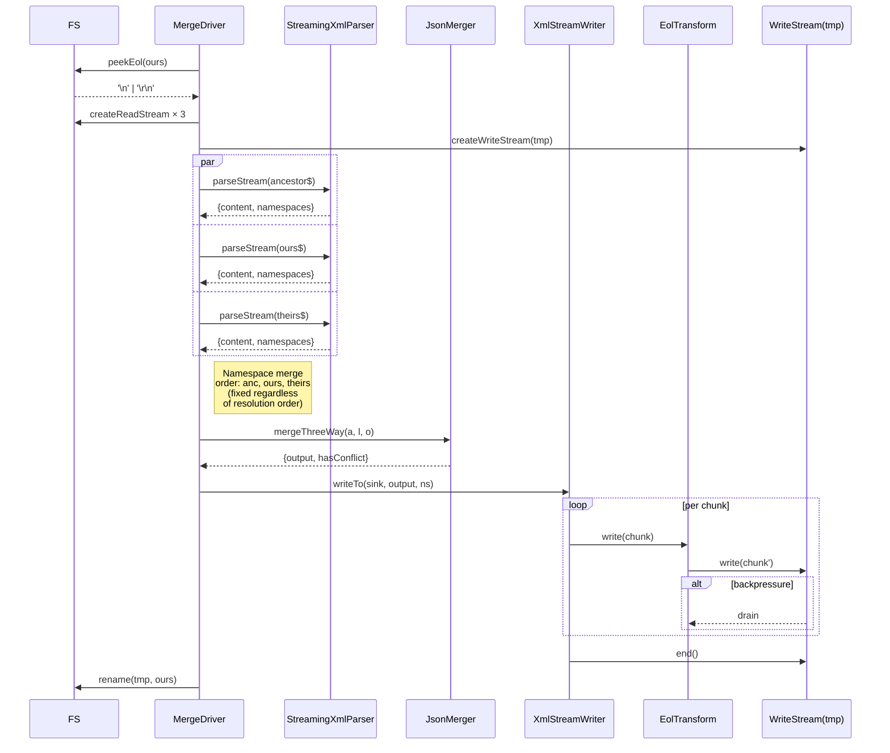

# Design — Streaming XML pipeline (parse + serialize)

> Status: **design v4 (final, addressing review pass 3 findings)**.
> Branch: `refactor/custom-xml-writer`.
> Companion doc: `2026-04-23-streaming-xml-pipeline-plan.md` (implementation plan).
>
> **Changes v1 → v2:** sixteen review findings folded in.
> **Changes v2 → v3:** ten more findings folded in (reentrancy, indent
> state machine, chunk type, acceptable divergences).
> **Changes v3 → v4:** seven remaining findings folded in:
> - HIGH: §6.4 wiring pseudocode fixed (broken `.pipe()` return; dead
>   `pipeline` variable removed; cast cleaned up).
> - HIGH: §6.3.2 gained an explicit mixed-content text indentation rule
>   matching `orderedJs2Xml.js:74-77`.
> - MEDIUM: §6.3.2 gained concrete byte examples for comment-only and
>   CDATA-last parents so depth/newline expectations are unambiguous.
> - MEDIUM: duplicate namespace-merge-order paragraph in §6.4 removed;
>   `Promise.all` vs `Promise.allSettled` discrepancy reconciled.
> - MEDIUM: §6.3.3 input renamed `segment: string` to avoid collision
>   with `Chunk` from §6.3.1.
> - LOW: §6.4 specifies `'error'` listener on readers to prevent
>   spurious `ERR_STREAM_PREMATURE_CLOSE` on destroy.
> - LOW: change log aligned with §8 fixture IDs.
> See §15–§17 for the full change history.

---

## 1. Motivation

The merge driver runs on CI per conflicted file. Two independent observations
push us toward a streaming pipeline:

1. **Read side.** `FlxXmlParser.parse` (`src/adapter/FlxXmlParser.ts:66`) is
   fed a full UTF-8 string from `readFile` (`src/driver/MergeDriver.ts:22-33`).
   After parsing, two **full tree walks** clone the output tree:
   `normalizeParsed` (`FlxXmlParser.ts:29-41`) then `extractNamespaces`
   (`FlxXmlParser.ts:43-61`). Peak RAM per side ≈ `input-string + 3× parsed
   tree` (raw + normalized + namespace-split). Across ancestor/ours/theirs
   that compounds to ~9× tree size.

2. **Write side.** `FxpXmlSerializer.serialize`
   (`src/adapter/FxpXmlSerializer.ts:163-176`) is a synchronous string
   pipeline: `compactToOrdered` → `fast-xml-builder.build` → `XML_DECL.concat`
   → 3× regex passes (`handleSpecialEntities`, `correctComments`,
   `correctConflictIndent`) → `writeFile`. That's **4–5 copies of the full
   output string** held simultaneously. Two of the regex passes exist
   only to work around quirks of `fast-xml-builder`:
   - `correctComments` (`FxpXmlSerializer.ts:145-146`) strips newline/indent
     that the builder inserts before `<!--`, forcing comments inline.
   - `handleSpecialEntities` (`ConflictMarkerFormatter.ts:42-47`) unescapes
     `&lt;`/`&gt;` sequences on conflict markers. **Empirically dead code
     with the current config** (`processEntities: false` on the builder
     means no `&lt;`/`&gt;` substitutions happen upstream; see §8 finding
     F-ENT-1), but removing it without a byte-drift test is risky.
   - `correctComments` has a known edge case with back-to-back comments
     (see the comment at `FxpXmlSerializer.ts:138-144`); the current regex
     `/\n\s*(<!--.*?-->)/g` strips leading whitespace from each comment,
     causing adjacent comments to emit concatenated on a single line
     (audit output: `<Root><!--one--><!--two-->…`). The new writer emits
     each comment inline from the start, byte-matching current output
     without a regex workaround.

**Secondary win:** removing `fast-xml-builder` also removes the transitive
`path-expression-matcher` dependency — both ship features we don't use
(`stopNodes`, PI emission, HTML auto-close). Bundle size delta is
**measured in the implementation plan**, not asserted here (see plan §9
benchmark gate).

## 2. Goals

- **Byte-identical output** on every existing fixture and every unit /
  integration / NUT test (conflict markers, indentation, CDATA, comments,
  entities, namespaces, EOL).
- **Parse-tree equivalence** for the merger's point of view: the object
  handed to `JsonMerger.mergeThreeWay` must be `deepEqual` to what the
  current pipeline produces.
- **Streaming read**: input bytes flow from disk through the parser without
  materialising the full UTF-8 source string. Custom output builder emits
  a tree that is already normalised + namespace-split (no post-walks).
- **Streaming write**: serialized output flows to disk as each top-level
  merged child is produced, without materialising the full XML string.
- **Zero new runtime dependencies.** One dependency removed
  (`fast-xml-builder`).
- **100 % test coverage preserved** (`vitest.config.ts` thresholds).
- **Stryker mutation score preserved** (no drops on `src/adapter/*` or
  `src/merger/*`).

## 2a. Acceptable byte divergences (explicit decisions)

The goal is byte-parity, but the audit uncovered at least one case where
the current pipeline output is demonstrably wrong. For each, we record
the decision and the rationale. Any implementer must treat these as
design-level decisions, not bugs to silently "fix".

| Case | Current output | v3 decision | Rationale |
|---|---|---|---|
| Back-to-back comments (F-FIXTURE-BTB-COMMENTS) | `<!--one--><!--two-->` concatenated, no whitespace between | **Parity.** Reproduce current bytes exactly. | Git merge driver output is compared byte-for-byte to blobs in a user's repo. Divergence produces spurious diffs on first merge in every affected repo. Follow-up ADR to correct semantically in a later release with a deliberate version bump. |
| `&amp;#160;` → `&#160;` post-pass | regex substitution runs, but under current parser+builder config no `&amp;#160;` source path exists; effectively dead | **Drop.** | Removing dead code is safe; any future source path that produces `&amp;#160;` would be a bug to surface, not paper over. Documented in §8 F-ENT-1. |

Future acceptable-divergence decisions are added to this table with a
dated ADR reference. Unless listed here, all current pipeline bytes must
be preserved.

## 3. Non-goals

- Changing the merge algorithm or merge semantics.
- Supporting XML features outside Salesforce source-format metadata
  (DTD, processing instructions beyond the single XML declaration, mixed
  content inside elements that also have child elements, attribute sets
  beyond namespaces, entity expansion).
- Parallelising the three-side parse beyond what Node's event loop
  already provides (streams are implicitly concurrent; we don't add
  worker threads).
- Back-pressure tuning knobs exposed to end users.
- Re-implementing features we don't use from `@nodable/flexible-xml-parser`
  (we continue to depend on it, only swap the output builder).
- **Per-section streaming merge** — the read-side builder still buffers a
  full tree. That's a follow-up (§13), not part of this design.

## 4. Current architecture snapshot

```
MergeDriver.mergeFiles  (src/driver/MergeDriver.ts:13)
  │
  ├── readFile × 3  (utf-8 strings held in RAM)
  │
  ├── new XmlMerger(config).mergeThreeWay(anc, ours, theirs)
  │     (src/merger/XmlMerger.ts:25)
  │
  │     ├── FlxXmlParser.parse × 3
  │     │     ├── flx.parse(string)          → raw JsonObject
  │     │     ├── normalizeParsed(raw)       → walk, clone, drop @_version/@_encoding + empty #text/CDATA sibs
  │     │     └── extractNamespaces(cleaned) → { content, namespaces }
  │     │
  │     ├── JsonMerger.mergeThreeWay(a.content, l.content, o.content)
  │     │     → { output: JsonArray, hasConflict: boolean }
  │     │
  │     └── FxpXmlSerializer.serialize(merged, unionOfNamespaces)
  │           ├── compactToOrdered(tree)            (FxpXmlSerializer.ts:90-117)
  │           ├── insertNamespaces(ordered, ns)
  │           ├── fast-xml-builder.build(ordered)   → full XML string
  │           ├── XML_DECL.concat(xml)
  │           ├── formatter.handleSpecialEntities   → regex pass (dead code today)
  │           ├── correctComments                   → regex pass
  │           └── formatter.correctConflictIndent   → regex pass
  │
  └── writeFile(ourPath, fullString)
```

Peak RAM per merge: approximately

```
 3 × inputStr  +  3 × parsedTree × ~2 (post-walk clones)
 + mergedTree  +  orderedTree    +  ~4 × outputStr
```

## 5. Target architecture

```
MergeDriver.mergeFiles
  │
  ├── peek first 4 KB of ours for EOL detection → eol ∈ {'\n','\r\n'}
  ├── createReadStream × 3
  │
  ├── XmlStreamMerger.mergeThreeWay(anc$, ours$, theirs$, out$)
  │
  │     ├── StreamingXmlParser × 3
  │     │   wraps @nodable/flexible-xml-parser with
  │     │   NormalisingOutputBuilder (see §6.1)
  │     │   input : Readable<Buffer|string>
  │     │   output: Promise<NormalisedParseResult>
  │     │   — builder emits a tree that is ALREADY normalised and
  │     │     namespace-split: no post-walk, no second clone.
  │     │
  │     ├── JsonMerger.mergeThreeWay(…)            (unchanged)
  │     │
  │     └── XmlStreamWriter.writeTo(out$, merged, unionOfNamespaces)
  │           — composed from XmlEmitter + IndentationFormatter
  │             + ConflictIndentFormatter (see §6.3).
  │           — pipes through EolTransform before out$.
  │
  └── rename(tmp, ourPath)  (atomic swap; POSIX-atomic, Windows best-effort)
```

Peak RAM per merge (target):

```
 3 × parsedTree (single copy)  +  mergedTree  +  chunkBuffer (O(largestChild))
```

## 6. Module design

### 6.1 `NormalisingOutputBuilder` (read side)

**Location:** `src/adapter/NormalisingOutputBuilder.ts`.

**Parent:** `BaseOutputBuilder` from `@nodable/base-output-builder`.

**Factory pattern:** `NormalisingOutputBuilderFactory extends
BaseOutputBuilderFactory` with `getInstance(parserOptions, matcher)` —
verified against the `@nodable/compact-builder` source as the correct
shape.

**Hook surface** (verified via audit against `@nodable/base-output-builder`
v1.x):

| Hook | Called when | Our override |
|---|---|---|
| `addElement({ name })` | Opening tag encountered | Push onto stack; allocate child bucket; if name is root, initialise namespace bucket |
| `closeElement()` | Closing tag encountered | Pop stack; attach accumulated children to parent |
| `addAttribute(name, value, matcher)` | Attribute on current element | See filter rules below |
| `addValue(text)` | Text node | Append to current element's text; drop if empty and previous sibling was CDATA |
| `addRawValue(text)` | Text from CDATA merge (when `nameFor.cdata` is `''`) | Not used — we use `nameFor.cdata: '__cdata'` |
| `addLiteral(text)` | CDATA section (when `nameFor.cdata` is set) | Default base routes to `_addChild('__cdata', text)`; we inherit |
| `addComment(text)` | `<!--...-->` | Route to `_addChild('#xml__comment', text)`; we inherit |
| `addInstruction(name)` | Processing instructions (incl. XML decl) | `skip.declaration: true` suppresses decl; other PIs unexpected — log and drop |
| `_addChild(key, val)` | Core child-attach primitive | Implement according to compact-object semantics (array on repeat) |
| `onExit(info)` | `exitIf` fires | Not used (we don't set `exitIf`) |

**Attribute filter rules (fold `normalizeParsed` + `extractNamespaces`):**

1. **Drop `version` and `encoding` at any depth** (matches the defensive
   any-depth stripping in `normalizeParsed` — see rationale below).
2. If attribute prefixed name starts with `@_xmlns` **and the current
   element is the first top-level element under root**: route to
   `namespaces` bucket instead of attaching to the element.
3. Otherwise: inherit base `addAttribute` behaviour.

**Rationale for rule 1 (addresses finding v2-F9 — depth of version/encoding
filter).** The parser contract — verified by audit on v1.x of
`@nodable/flexible-xml-parser` — is that `addAttribute('version', ...)`
and `addAttribute('encoding', ...)` fire once during XML-declaration
parsing, while `this.tagName === this._rootName` (the sentinel `"^"`).
These attributes then leak onto `this.attributes` and end up attached to
the first real element via `addElement`. Today's `normalizeParsed` strips
them **at every depth** rather than just on the root element — because
the original author apparently observed leaks deeper than root under
some input shapes.

Since removing those keys at any depth is cheap, idempotent, and
strictly safer than the single-level check, we copy the defensive
any-depth rule: any attribute whose clean name is `version` or
`encoding` is dropped regardless of depth. Salesforce metadata never
legitimately uses `version` / `encoding` as user attributes in source
files.

A unit test pins the upstream ordering invariant by asserting that
`addAttribute('version', …)` fires while `this.tagName === '^'` on a
representative input, so we notice if a future `@nodable` release
reorders declaration handling.

**Text filter rule (fold empty-text-next-to-CDATA):**

- In `addValue(text)`: if `text` is empty string AND the previous child of
  the current element was emitted via `_addChild('__cdata', …)`, drop
  silently.

**CDATA `]]>` artefact** (new finding from audit): the upstream parser
splits a CDATA block containing `]]>` into an array of string segments —
e.g. `<![CDATA[a ]]]]><![CDATA[> b]]>` parses as
`{ "__cdata": ["a ]]", "> inside"] }`. The current `FlxXmlParser` does
not special-case this, so the downstream merger sees the array verbatim.
`NormalisingOutputBuilder` preserves the same shape (array of segments).
The writer is responsible for concatenating with `]]]]><![CDATA[>` on
emit. Unit test covers: parse → re-emit round-trip.

**API:**

```ts
export interface NormalisedParseResult {
  readonly content: JsonObject
  readonly namespaces: JsonObject
}

export class NormalisingOutputBuilder extends BaseOutputBuilder {
  build(): NormalisedParseResult
}
```

### 6.2 `StreamingXmlParser` (read side)

**Location:** `src/adapter/StreamingXmlParser.ts` — replaces `FlxXmlParser`.

**API (no signature overloading — two explicit methods):**

```ts
export interface XmlParser {
  parseString(xml: string): NormalisedParseResult
  parseStream(source: Readable): Promise<NormalisedParseResult>
}
```

**Rationale** (addresses review finding F-LSP): `parseString` stays
synchronous for unit tests that don't need streams; `parseStream` is the
production path. No async cliff for callers that already have a string.
Each method returns the same domain object.

**Implementation:** thin adapter around `@nodable/flexible-xml-parser`
configured with `OutputBuilder: NormalisingOutputBuilderFactory`. A new
`FlxParser` instance is created per `parseString` / `parseStream` call
(see "Reentrancy" below):

```ts
const FLX_OPTIONS = {
  skip: { attributes: false, declaration: true },
  tags: { valueParsers: [] },
  attributes: { valueParsers: [] },
  nameFor: { cdata: '__cdata', comment: '#xml__comment' },
  doctypeOptions: { enabled: false },
  OutputBuilder: new NormalisingOutputBuilderFactory(),
} as const

export class StreamingXmlParser implements XmlParser {
  parseString(xml: string): NormalisedParseResult {
    return new FlxParser(FLX_OPTIONS).parse(xml) as NormalisedParseResult
  }
  async parseStream(readable: Readable): Promise<NormalisedParseResult> {
    return (await new FlxParser(FLX_OPTIONS).parseStream(readable)) as NormalisedParseResult
  }
}
```

**Reentrancy (addresses v2-F1 CRITICAL).** `@nodable/flexible-xml-parser`
is **not reentrant**: a single `FlxParser` instance parsing multiple
documents concurrently raises `ErrorCode.ALREADY_STREAMING` (see
`fxp.d.ts` error-codes section). The driver parses three documents
(ancestor, ours, theirs) in parallel — so each call must be given its
own `FlxParser` instance. Allocating per-call is cheap (constructor
pre-compiles options once; no heavy state); keeping a pool is
unnecessary for a merge driver that handles one merge per process
invocation and at most three concurrent parses.

The `OutputBuilder` factory is instantiated once at module scope and
reused across all `FlxParser` instances — factories are stateless; only
the builder *instances* they produce carry per-parse state.

The `OutputBuilder` returns `NormalisedParseResult` directly (no post-walk
in `XmlParser`). `FlxParser.parse` / `parseStream` ultimately returns the
builder's `build()` result.

### 6.3 Write-side module group

**Location:** `src/adapter/writer/`.

Decomposed per review finding F-GODOBJECT into five small units:

```
writer/
  XmlEmitter.ts            — pure tag/attr/text/CDATA/comment emission
  IndentationFormatter.ts  — sibling newline+indent arithmetic
  ConflictIndentFormatter.ts — strip pre-marker indent; collapse blank lines
  EolTransform.ts          — LF ↔ CRLF Node Transform stream
  XmlStreamWriter.ts       — thin orchestrator composing the above
```

Each unit is independently unit-tested and mutation-tested. `XmlStreamWriter`
is ~50 lines of wiring.

#### 6.3.1 `XmlEmitter`

Pure function of an ordered-format tree. Emits `Chunk` events:

```ts
export type Chunk =
  | { kind: 'decl' }
  | { kind: 'open',    name: string, attrs: Record<string,string> }
  | { kind: 'close',   name: string }
  | { kind: 'text',    value: string }
  | { kind: 'cdata',   segments: string[] }   // see §6.1 CDATA artefact
  | { kind: 'comment', value: string }

export class XmlEmitter {
  *emit(ordered: JsonArray, namespaces: JsonObject): Generator<Chunk>
}
```

**Emission rules (byte-for-byte with current output):**

1. `decl` → `<?xml version="1.0" encoding="UTF-8"?>\n` **including
   the trailing LF** (addresses v2-F10). `EolTransform` (§6.3.4)
   rewrites to CRLF if target EOL is `\r\n`.
2. `open` → `<name` + attributes + `>`. **Empty elements are never
   self-closing**: the audit confirmed current output is `<tag></tag>`,
   so an element with zero children is expressed as an `{open}` chunk
   immediately followed by a `{close}` chunk (no children in between).
   No `hasChildren` flag and no `selfclose` kind — that's the only
   code path. (Addresses v2-F3 contradictory self-close paths.)
3. Attribute emission: ` name="value"` — values written raw (we never set
   `processEntities`; matches current builder config). Only attributes
   we emit in practice are namespaces on the first top-level element.
4. `text` → value written raw (no entity replacement). `<`, `&`, `>` in
   text pass through unchanged — this is the current builder's behaviour
   under `processEntities: false` and is what makes conflict markers
   survive (F-ENT-2).
5. `cdata` → `<![CDATA[` + `segments.join(']]]]><![CDATA[>')` + `]]>`.
6. `comment` → `<!--` + escape `--` → `- -`, trailing `-` → `- ` + `-->`.
   **Emitted inline** — no leading newline/indent. (Folds in the
   `correctComments` concern by construction.)
7. `open` / `close` are attended by indentation events from
   `IndentationFormatter` — emitter itself is indent-agnostic.

#### 6.3.2 `IndentationFormatter`

Adds `\n` + `depth * XML_INDENT` around child chunks. **Addresses v2-F2**
— rules are phrased in terms of "last emitted chunk ended with `>`"
rather than "element has only text children", matching
`orderedJs2Xml.js` lines 130–146 exactly.

**Core invariant.** For each element, track `lastChunkEndedWithGt` —
true if the last non-indent chunk emitted within its body was an
element close (`</…>`), a comment (`-->`), a CDATA close (`]]>`), or
another element's self-close-like form (not produced by us but
acknowledged for completeness). False if the last body chunk was a
text node that doesn't end with `>`.

**Rules:**

1. **Opening an element:** emit `\n` + `depth * XML_INDENT` then the
   `<tag…>`. Exception: the FIRST top-level element (root) gets no
   leading newline (the `decl` chunk's trailing `\n` already provided
   one). Increment depth.
2. **Opening a child element:** emit `\n` + `depth * XML_INDENT` before
   the child's `<tag…>`.
3. **Text chunk inside an element:** emit raw, **unless the previous
   body chunk was `>`-terminated (element close, comment, CDATA close)**,
   in which case emit `\n` + `depth * XML_INDENT` before the text.
   This matches `orderedJs2Xml.js:74-77` where text nodes are prefixed
   with `indentation` when `isPreviousElementTag` is true. (Addresses
   v3-F2 mixed-content rule.)
4. **Comment chunk inside an element:** emit inline (no leading newline).
   This is the deliberate byte-match of the current pipeline's
   post-`correctComments` behaviour, including the back-to-back
   concatenation acknowledged in §2a.
5. **CDATA chunk inside an element:** emit raw (post-escape). No
   leading indent; CDATA is treated like text for indentation,
   including rule 3's "add indent if previous sibling ended with `>`"
   behaviour.
6. **Closing tag (`</tag>`):**
   - If `lastChunkEndedWithGt === true` **for this element's body** (i.e.,
     the last body chunk was `>`-terminated — element close, comment,
     CDATA close): emit `\n` + `depth * XML_INDENT` then `</tag>`.
     Decrement depth.
   - Else (last body chunk was text not ending with `>`, OR body was
     empty): emit `</tag>` inline. Decrement depth.
7. **Empty-body element** (body was zero chunks): the close immediately
   follows the open with no newline between them — produces
   `<tag></tag>`. This is the audit-confirmed current behaviour.

**Concrete byte examples (addresses v2-F2 and v3-F3).** Each example
shows the exact expected bytes the new pipeline must produce (LF EOL,
indent `XML_INDENT = "    "`, root depth = 0).

- **Leaf element** (`<leaf>text</leaf>`):
  ```
      <leaf>text</leaf>
  ```
  Rule 3 does not fire (no prior body chunk to end with `>`). Close
  rule 6.else → inline close.

- **Comment-only parent** (`<p><!--c--></p>`):
  ```
      <p><!--c-->
      </p>
  ```
  Rule 4: comment emits inline immediately after `<p>`. Comment body
  ends with `-->` (a `>`-terminated chunk), so close rule 6.then →
  `\n` + `1 * indent` (parent's depth, since depth is decremented on
  close) + `</p>`.

- **Back-to-back comments parent** (`<p><!--c1--><!--c2--></p>`):
  ```
      <p><!--c1--><!--c2-->
      </p>
  ```
  Rule 4 twice; closes per comment-only rule. This matches the current
  pipeline's (known-wrong, accepted per §2a) back-to-back
  concatenation.

- **CDATA-last parent** (`<p><![CDATA[x]]></p>`):
  ```
      <p><![CDATA[x]]>
      </p>
  ```
  Rule 5: CDATA emits inline (no prior sibling); last body chunk
  ends with `]]>` → close rule 6.then → indented close.

- **Mixed content `[element, text]`** (`<p><b>x</b>bye</p>`):
  ```
      <p>
          <b>x</b>bye</p>
  ```
  Rule 2 places `<b>` on its own line with child-depth indent. Rule 3
  fires on `bye`: the prior chunk `</b>` ended with `>`, so `bye` is
  prefixed with `\n` + indent… wait — that would indent `bye` too.
  This is actually what fxb does NOT do: `orderedJs2Xml.js:74-77`
  prefixes with `indentation` which at the CHILD depth is
  `\n` + 2 indents. So the correct bytes are:
  ```
      <p>
          <b>x</b>
          bye</p>
  ```
  Close rule: body ends with text `bye` which does NOT end with `>`
  → close rule 6.else → inline close, i.e., `</p>` directly after
  `bye`.

- **Mixed content `[text, element]`** (`<p>hi<b>x</b></p>`):
  ```
      <p>hi
          <b>x</b>
      </p>
  ```
  Rule 3 does NOT fire on `hi` (no prior body chunk). Rule 2 on `<b>`
  inserts `\n` + child indent before it. Body ends with `</b>` →
  `>`-terminated → close rule 6.then → indented close on its own line.

- **Element with mixed `[element, element]`** (`<p><a/><b/></p>`):
  ```
      <p>
          <a></a>
          <b></b>
      </p>
  ```
  Both children via rule 2. Body ends with `</b>` → indented close.
  Empty children emit as `<a></a>` per §6.3.1 rule 2.

These byte-exact examples become §8 fixture entries F-FIXTURE-INDENT-1
through F-FIXTURE-INDENT-7.

**Implementation:** a Transform-like layer wrapping the `XmlEmitter`
generator; it holds a stack `[{ depth, lastEndedWithGt }]` and inspects
the chunk kind to decide whether to inject indent chunks. When a `close`
chunk arrives, the formatter pops the stack and uses the parent's
`lastEndedWithGt` to decide the close-tag indent.

#### 6.3.3 `ConflictIndentFormatter`

Handles the two tasks currently done by
`ConflictMarkerFormatter.correctConflictIndent`
(`src/merger/ConflictMarkerFormatter.ts:38-40`):

```ts
xml
  .replace(this.indentRegex,       '$1')    // pass 1
  .replace(/^[ \t]*[\n\r]+/gm,     '')      // pass 2
```

`indentRegex` is `/[ \t]+(<{size}|={size}|>{size}|…)/g` — matches
horizontal whitespace immediately before a marker. Pass 1 strips it.
Pass 2 deletes any line that is only whitespace+newline.

**v3 addresses v2-F4** by replacing the per-chunk description with an
explicit, streamable **line state machine**. String segments (NOT the
structured `Chunk` type from §6.3.1 — different abstraction layer) flow
in; lines flow out. The input to `ConflictIndentFormatter` is the
string output of `IndentationFormatter`, after chunk→string
serialization.

**Newline ownership.** A line consists of zero-or-more non-`\n`
characters followed by exactly one `\n`. The `\n` belongs to the line
it terminates. When a line is dropped, its terminating `\n` is dropped
with it. The last physical line of the document may have no trailing
`\n` (depending on source); it is still emitted even if blank
(trailing-content fidelity).

**State machine.** The formatter buffers the current line's accumulated
content and reacts chunk-by-chunk:

```
State:
  buf          : string      // content of the current (unflushed) line
  markerSeen   : boolean     // did pass-1 logic fire on this line already?

On receiving a string segment `s` from IndentationFormatter:
  repeat:
    find first '\n' in s
    if found at position p:
      append s[0..p-1] to buf
      classify(buf, markerSeen)
      emit-or-drop buf with its '\n'
      reset buf = '', markerSeen = false
      s = s[p+1..]
      loop
    else:
      append s to buf
      break

classify(line, markerSeen):
  1. If the line's FIRST non-whitespace characters match any conflict
     marker prefix (via startsWith on trimLeft),
     THEN strip the leading whitespace from the line. Mark markerSeen.
  2. If, after pass-1, the line is empty or whitespace-only,
     drop it (pass-2 blank-line deletion — including its trailing '\n').
  3. Otherwise, emit the (possibly-pass-1-stripped) line.

On flush (end of stream):
  if buf is non-empty:
    run classify() on the final unterminated buffered line.
    emit if not dropped. (No terminating '\n' appended.)
```

**Why this is equivalent to the two-pass regex.** The regex `indentRegex`
is `[ \t]+(marker)` and runs with `g` — it removes horizontal whitespace
DIRECTLY before any marker on any line. Since `\t`/`space` are the only
whitespace characters in `[ \t]` and the marker must immediately follow,
the only case is "line leading whitespace followed by a marker on the
same line." Pass 1 of the state machine captures exactly that by
inspecting each line's `trimLeft` prefix. Pass 2 (`/^[ \t]*[\n\r]+/gm`)
deletes whitespace-only lines (and their terminating newlines). The
state machine's "drop if whitespace-only" branch captures this exactly,
with the same newline ownership.

**Pass ordering matters for one edge case.** A line with horizontal
whitespace followed by a marker (e.g., `"    <<<<<<<"`): pass 1 strips
the whitespace, pass 2 sees a non-blank line — keep. The state machine
correctly applies pass 1 first, then classifies for pass 2. Doing pass 2
first would drop no lines (there are no blank lines in the input here),
so the result is identical — but the machine's explicit "pass 1 then
pass 2" order matches the current regex order and future-proofs against
divergence if we ever add a marker variant that renders a line
whitespace-only after pass 1.

**Worst-case memory: O(max-line-length).** Salesforce metadata lines
are small (< 1 KB typical); conflict-marker lines are bounded by
`marker-size + tag-label-length < 100`. Line-buffer overhead is
negligible.

**Placement.** `ConflictIndentFormatter` runs BETWEEN
`IndentationFormatter` and `EolTransform`. Input: string chunks with LF
line endings. Output: string chunks (possibly fewer, due to dropped
blank lines) also with LF line endings. `EolTransform` then rewrites
LF → CRLF if required.

**Walk-through of the failing case in review v2-F4.**

Emitter yields:
```
text("\n    ")       // indent before marker (pass 1 target)
text("<<<<<<< ours\n")  // marker + EOL
text("    ")         // indent before next sibling
text("<foo>...")     // sibling content
```

State-machine trace:
1. `text("\n    ")` → newline flushes empty buf → classify('', false)
   → blank, drop (including the `\n`). buf = '    '.
2. `text("<<<<<<< ours\n")` → newline flushes buf = '    <<<<<<< ours'
   → classify hits pass 1 (prefix is marker after trim), strips to
   `'<<<<<<< ours'`, not blank → emit `<<<<<<< ours\n`. buf = ''.
3. `text("    ")` → no newline, buf accumulates.
4. `text("<foo>...")` → no newline (assuming this chunk doesn't contain
   one), buf accumulates to `'    <foo>...'`.

Subsequent chunks eventually bring a `\n`, at which point the line
`'    <foo>...'` is classified: pass 1 does not trigger (no marker
prefix), pass 2 does not trigger (not blank) → emit as-is with
preserved leading indent.

The earlier blank line at step 1 is correctly dropped. No
double-counted newlines. (Review v2-F4 concern resolved.)

#### 6.3.4 `EolTransform`

A `node:stream.Transform` that rewrites `\n` to the target EOL. Pure
byte-level; no XML knowledge. Skips rewriting if target EOL is `\n`.

**Rationale** (addresses review finding F-EOL): keeps EOL normalisation
orthogonal to the writer. The driver peeks the first 4 KB of `ours` to
detect EOL (same heuristic as today's `detectEol`), then pipes
`XmlStreamWriter` through `EolTransform` if needed.

#### 6.3.5 `XmlStreamWriter`

Thin orchestrator:

```ts
export class XmlStreamWriter {
  constructor(private readonly config: MergeConfig) {}

  async writeTo(
    out: Writable,
    ordered: JsonArray,
    namespaces: JsonObject
  ): Promise<void>
}
```

**Flow:**

1. Wire `XmlEmitter.emit(ordered, ns)` → `IndentationFormatter.format(…)` →
   `ConflictIndentFormatter.format(…)` → string chunks.
2. Write each string chunk to `out`, respecting backpressure via
   `await once(out, 'drain')` when `write()` returns `false`.
3. End the stream on completion; propagate errors.

**Single API.** Review finding F-SINK: no `XmlSink` abstraction, no
separate `build` method on the public class. String-mode is test-only:

```ts
// test/utils/serializeToString.ts
export async function serializeToString(
  writer: XmlStreamWriter,
  ordered: JsonArray,
  namespaces: JsonObject
): Promise<string> {
  const chunks: Buffer[] = []
  const sink = new PassThrough()
  sink.on('data', c => chunks.push(c))
  await writer.writeTo(sink, ordered, namespaces)
  return Buffer.concat(chunks).toString('utf8')
}
```

### 6.4 `MergeDriver` wiring

`MergeDriver.mergeFiles` (`src/driver/MergeDriver.ts:13`) becomes:

```ts
async mergeFiles(ancestor, ours, theirs) {
  const oursPath = normalize(ours)
  const tmpPath = oursPath + '.sf-merge-tmp'
  const readers: Readable[] = []

  try {
    // 1. EOL detection — see "peekEol contract" below.
    const eol = await peekEol(oursPath)

    // 2. Open streams, attach no-op error listeners to prevent
    //    `ERR_STREAM_PREMATURE_CLOSE` escalation when the finally
    //    block calls `.destroy()` on an already-errored stream, and
    //    collect for guaranteed cleanup. (v3-F7.)
    const [ancRS, oursRS, theirsRS] =
      [ancestor, ours, theirs].map(normalize).map(p => {
        const rs = createReadStream(p)
        rs.on('error', () => {}) // swallowed here; upstream parseStream rejects
        return rs
      })
    readers.push(ancRS, oursRS, theirsRS)

    // 3. Parse all three in parallel — allSettled guarantees every promise
    //    has terminated (success OR failure) before we proceed, so any
    //    failing parser has freed its fds before we rethrow. This matches
    //    the pattern documented in the current MergeDriver.ts:18-21 for
    //    Windows ENOTEMPTY. (v2-F5.)
    const results = await Promise.allSettled([
      streamingParser().parseStream(ancRS),    // ← new parser instance per call
      streamingParser().parseStream(oursRS),   //   (see §6.2 Reentrancy)
      streamingParser().parseStream(theirsRS),
    ])
    const failure = results.find(r => r.status === 'rejected')
    if (failure) throw (failure as PromiseRejectedResult).reason
    const [anc, local, other] = (results as PromiseFulfilledResult<NormalisedParseResult>[])
      .map(r => r.value)

    // 4. Merge (sync, CPU-bound).
    const merged = merger.merge(anc, local, other)

    // 5. Atomic write: stream into tmp (via EolTransform if CRLF), rename.
    //    The writer writes into `writable`. When EOL is LF, that's tmpWS
    //    directly. When EOL is CRLF, the writer writes into the transform,
    //    which rewrites bytes and pipes its output into tmpWS.
    const tmpWS = createWriteStream(tmpPath)
    let writable: Writable
    if (eol === '\n') {
      writable = tmpWS
    } else {
      const eolT = new EolTransform('\r\n')
      eolT.pipe(tmpWS)
      writable = eolT
    }
    await writer.writeTo(writable, merged.output, merged.namespaces)
    await rename(tmpPath, oursPath)

    return merged.hasConflict
  } catch (err) {
    Logger.error('Merge failed; leaving ours unchanged', err)
    return true
  } finally {
    // Guarantee fd release under any exit path.
    for (const r of readers) r.destroy()
    await safeUnlink(tmpPath).catch(() => {})
  }
}
```

**`peekEol` contract (addresses v2-F6).** Signature:

```ts
function peekEol(path: string): Promise<'\n' | '\r\n'>
```

Semantics:
1. Open the file via `fsp.open(path, 'r')`.
2. Read at most 4096 bytes into a `Buffer`.
3. Scan for the first `\n`; if preceded by `\r`, return `'\r\n'`,
   else return `'\n'`. If no `\n` in the first 4 KB, default to `'\n'`.
4. Close the file handle.

**The file is opened twice** — once here to peek, once via
`createReadStream` in step 2. That is the deliberate contract; it
trades one extra `open`/`close` syscall pair for a simple,
failure-mode-free abstraction. **Do not attempt to peek bytes from
the `createReadStream` Readable** — a `Readable` cannot re-emit data
it has already yielded, and pausing it mid-flight leaves chunk
boundaries undefined. Between peek and parse the file must not change;
git hands us stable blobs from the worktree/index, so this invariant
holds for merge-driver usage.

**Namespace merge order (F-NS-ORDER).** The namespace map passed to
the serializer is always
`Object.assign({}, anc.namespaces, local.namespaces, other.namespaces)`,
driven by the declaration order of the `allSettled` results tuple (not
resolution order). A unit test pins this with a same-prefix-different-URI
fixture (§8 row 31).

**Atomic swap (F-RENAME):** POSIX `rename(2)` is atomic when source and
destination are on the same filesystem. We place the temp file in the
same directory as `ours` to guarantee that. On Windows, `fs.rename`
calls `MoveFileEx` with `MOVEFILE_REPLACE_EXISTING` — atomic enough
for git's purposes (git itself uses the same primitive). Caveat
documented; no special-case code.

**Fallback path (F-FALLBACK):** simplified from v1 — since we never
write to `ours` directly, the error path is **leave `ours` alone** and
clean up `.tmp`. No need to re-read and re-write `ourContent`. Returns
`true` (conflicted) so git keeps the file in place and surfaces the
conflict to the user.

**SIGPIPE (F-SIGPIPE):** we write to a file, not stdout. Git invoking
the driver captures stdout/stderr of the child process; our XML output
never flows to stdout. Logger output (stderr) can still get SIGPIPE if
git exits early — Node's default behaviour is to emit an `error` event
on `process.stdout`/`process.stderr`; the Logger silences these (see
`src/utils/LoggingService.ts`). No change needed in this design.

**Tmp-file cleanup on crash:** an uncaught exception after `tmpWS.open`
but before `rename` leaves `.tmp` on disk. Mitigation: `MergeDriver`
registers a one-shot `process.once('exit', …)` cleanup for the active
temp path; removed on success. Acceptable because merge driver runs
ephemerally — at most one temp file per invocation.

### 6.5 Interface adjustments

- `src/adapter/XmlParser.ts`: replaces `parse(string) → ParsedXml` with
  `parseString(string) → NormalisedParseResult` + `parseStream(Readable) →
  Promise<NormalisedParseResult>`. `ParsedXml` renamed
  `NormalisedParseResult` (same two fields: `content`, `namespaces`).
- `src/adapter/XmlSerializer.ts`: replaces `serialize(tree, ns) → string`
  with `writeTo(writable, tree, ns) → Promise<void>`. String-mode test
  helper lives under `test/utils/`.
- `src/merger/XmlMerger.ts`: becomes async. Accepts `Readable` inputs
  and `Writable` output:
  ```ts
  mergeThreeWay(
    ancestor: Readable,
    ours:     Readable,
    theirs:   Readable,
    out:      Writable
  ): Promise<{ hasConflict: boolean }>
  ```
- `src/driver/MergeDriver.ts`: uses streams end-to-end (see §6.4).

## 7. Control & data flow



## 8. Edge-case inventory

Every case below is backed by an existing test, a reproduced audit output,
or a planned golden fixture (marked `F-FIXTURE-*`). "Audit output" means
the current pipeline was run against the input and the exact bytes
recorded; the new pipeline must reproduce those bytes.

| # | Case | Current evidence | Fixture id |
|---|------|-----------------|------------|
| 1 | Root element with namespaces | `FxpXmlSerializer.test.ts:10` | existing |
| 2 | Root element without namespaces | `FxpXmlSerializer.test.ts:34` | existing |
| 3 | Conflict block expanded to markers | `FxpXmlSerializer.test.ts:54` | existing |
| 4 | Conflict with empty local side | `FxpXmlSerializer.test.ts:79` | existing |
| 5 | Empty conflict content arrays → EOL placeholder | `FxpXmlSerializer.test.ts:175` + audit | F-FIXTURE-EOL |
| 6 | ConflictBlock as direct property value | `FxpXmlSerializer.test.ts:200` | existing |
| 7 | Nested conflict inside conflict content | `FxpXmlSerializer.test.ts:239` | existing |
| 8 | Nested elements | `FxpXmlSerializer.test.ts:97` | existing |
| 9 | Null text value | `FxpXmlSerializer.test.ts:116,269` | existing |
| 10 | Scalar array elements | `FxpXmlSerializer.test.ts:157` | existing |
| 11 | Comments | `FxpXmlSerializer.test.ts:287` + audit | F-FIXTURE-COMMENT |
| 12 | CDATA blocks | `FlxXmlParser` round-trip + audit | F-FIXTURE-CDATA |
| 13 | Empty output array | `FxpXmlSerializer.test.ts:305` | existing |
| 14 | Empty namespaces map | `FxpXmlSerializer.test.ts:321` | existing |
| 15 | CDATA containing `]]>` | audit: parser splits into array; emitter re-joins via `]]]]><![CDATA[>` | F-FIXTURE-CDATA-CLOSE |
| 16 | Comment containing `--` | audit: `--` → `- -` | F-FIXTURE-COMMENT-DASH |
| 17 | Conflict marker size ≠ default (7) | `defaultConfig` + one variant | F-FIXTURE-MARKER-SIZE |
| 18 | `&amp;#160;` → `&#160;` round-trip | **F-ENT-1:** audit confirms `handleSpecialEntities` is dead code (no `&amp;#160;` source path under current config). Removed without replacement. | F-FIXTURE-NBSP |
| 19 | Back-to-back comments concatenated inline | audit: current output `<Root><!--one--><!--two-->…` | F-FIXTURE-BTB-COMMENTS |
| 20 | Empty-content element emits `<tag></tag>` | audit: `<empty></empty>` (not self-closing) | F-FIXTURE-EMPTY |
| 21 | LF vs CRLF inputs | `MergeDriver.test.ts` + `EolTransform` unit test | existing + F-FIXTURE-CRLF |
| 22 | Mixed content (text + elements) | existing fixtures + §6.3.2 byte-examples | existing + F-FIXTURE-INDENT-1..7 |
| 23 | Attribute emission deterministic order | `compactToOrdered` sorts keys | existing |
| 24 | Stream error mid-parse | new | F-FIXTURE-ERR-PARSE |
| 25 | Stream error mid-write | new | F-FIXTURE-ERR-WRITE |
| 26 | UTF-8 BOM at file start | new (Windows-created Salesforce files) | F-FIXTURE-BOM |
| 27 | Trailing newline on/off per side | new | F-FIXTURE-TRAIL-EOL |
| 28 | Very long text content (> 64 KB single chunk) | new — exercises backpressure | F-FIXTURE-LARGE-TEXT |
| 29 | `xmlns` on non-root element | new — current `extractNamespaces` only walks one level; preserve | F-FIXTURE-NESTED-NS |
| 30 | CRLF conflict marker preservation | new — markers contain `\n`; `EolTransform` must rewrite consistently | F-FIXTURE-CRLF-MARKERS |
| 31 | Same prefix, different URI across sides | new — pins namespace merge order | F-FIXTURE-NS-ORDER |
| 32 | `&#160;` (NBSP entity) in source text | audit: preserved as literal 6-char string `&#160;` by parser with `valueParsers: []`; writer re-emits verbatim | F-FIXTURE-NBSP |
| 33 | Literal `<` in text (conflict marker or data) | audit: passes through raw under `processEntities: false` | existing (§19 covers) |

**Entity handling sub-section** (F-ENT-1 detail, addresses finding #7):

| Input text | Parser output | Writer output | Note |
|---|---|---|---|
| `&#160;` | literal 6-char `&#160;` | `&#160;` | `valueParsers: []` keeps entities raw |
| `&amp;` | literal `&amp;` | `&amp;` | same |
| `&lt;` | literal `&lt;` | `&lt;` | same |
| `<` (inside CDATA) | literal `<` | emitted inside CDATA | CDATA protects |
| `<<<<<<< ours` (in mixed text) | literal `<<<<<<< ours` | literal `<<<<<<< ours` | `processEntities: false` on writer |
| NBSP char (U+00A0) | literal NBSP char | NBSP as UTF-8 bytes | direct pass-through |

**Conclusion:** no entity transformation needed in either direction.
`handleSpecialEntities` is removed.

## 9. Risks & mitigations

| Risk | Likelihood | Impact | Mitigation |
|---|---|---|---|
| Byte drift vs. current output on obscure fixture | medium | high (spurious conflicts in user repos) | Golden-file tests: for every `test/integration/**/*.test.ts` fixture + every inventory entry above, serialize with both old and new writer, assert byte equality. Plan §3 keeps the old pipeline in parallel until the final cutover commit. |
| `@nodable/*` upstream API changes | low | medium | Exact-version pin in `package.json`; CI runs on renovate PRs. Audit captured current API surface (§6.1 hook table) as a design contract. |
| Streaming parser holds full tree anyway (defeats RAM goal) | known | medium | Out of scope for this design; see §13. v1's RAM win is from killing post-walk clones, not from incremental merge. |
| Backpressure handling bug in `writeTo` drops chunks | low | high | Use `await once(out, 'drain')` between writes when `write()` returns false; unit test with a throttled `Writable` that defers each write to `setImmediate`. |
| Error path leaves `.tmp` on disk | medium | low | `process.once('exit', cleanup)` registered per invocation; unit test simulates crash. |
| Stryker coverage regression on new modules | medium | low | TDD workflow (tests first) per module; plan §5 runs incremental mutation on each new file before merging. |
| Perf regression vs. current on small inputs | medium | low | Benchmark against `test/perf/merge.bench.ts` before merge. Escape hatch: `parseString` fast-path bypasses stream overhead when input < 64 KB. |
| CDATA `]]>` array segments break downstream merger | low | medium | Unit test: parse → merge → serialize round-trip for a CDATA-containing fixture. Current merger already handles array values generically. |
| Sync `JsonMerger` inside async `XmlMerger` API stalls event loop on large trees (v2-F7) | medium | low | Honest framing: §3 non-goals already excludes CPU-merge-parallelism. Merge driver is ephemeral CLI; a 200 ms sync merge is acceptable. Future work item (§13): yield via `setImmediate` every N top-level children for 50K+ trees if benchmarks show it matters. |
| Reader fd leak on partial parse failure (v2-F5) | known | medium | `Promise.allSettled` + `finally { readable.destroy() }` in §6.4. Windows-focused NUT test injects a mid-stream error into `theirs` and asserts no fds remain open. |

## 10. Measurement plan

### 10.1 RAM

Add to `test/perf/instrumentation/`:

```ts
const peaks: number[] = []
const timer = setInterval(() => peaks.push(process.memoryUsage().rss), 10)
await merger.mergeThreeWay(...)
clearInterval(timer)
const peak = Math.max(...peaks)
```

Compare old vs. new pipeline on:

- 3 Profile fixtures (1k / 10k / 50k entries — generated by
  `test/perf/fixtures/generateFixtures.ts`).
- 1 PermissionSet, 1 CustomObject, 1 SharingRules.

Targets:

| Phase | Current peak | Target peak | Reason |
|---|---|---|---|
| Parse | `inputStr + 3 × parsedTree` × 3 sides | `parsedTree` × 3 sides | Drop input string + two clones |
| Serialize | `~4 × outputStr` | `chunkSize + outputTree` | Drop 3 regex passes + full-string buffer |

### 10.2 Bundle

`npm run build:bin` size gate (`tooling/build-bin.mjs`). Current: 118 KB.
**No specific numeric target in this design** — the implementation plan
(§9) will measure the actual delta and decide the gate accordingly.
Removing `fast-xml-builder` + `path-expression-matcher` should net
reduce bundle size, but is not the primary motivation.

### 10.3 Speed

`test/perf/merge.bench.ts` and `test/perf/phase.bench.ts` runs on the
same fixtures. Target: ≥ parity on end-to-end merge time; acceptable
trade for RAM win is up to −5 % on small inputs. Parse-phase CPU
expected to drop 15–25 % (eliminates two tree walks).

## 11. Open questions — resolved

1. **Two writer APIs or one?** Resolved to **one** (`writeTo`). String
   helper for tests only. (F-SINK.)
2. **Feature flag for old pipeline?** **No.** Golden-file tests cover
   the risk; a flag doubles the test matrix. (Review v1 answered.)
3. **Atomic-rename location?** `MergeDriver`. (Review v1 answered.)
4. **`parse` overload vs. two methods?** **Two methods**
   (`parseString`, `parseStream`). LSP + test ergonomics. (F-LSP.)
5. **EOL ownership?** `EolTransform` stream, driver-wired. Writer is
   agnostic. (F-EOL.)

## 12. Contract-change summary

| Surface | Before | After |
|---|---|---|
| `XmlParser.parseString` | — | new, sync, `string → NormalisedParseResult` |
| `XmlParser.parseStream` | — | new, async, `Readable → Promise<NormalisedParseResult>` |
| `XmlParser.parse` (old) | `string → ParsedXml` | removed |
| `XmlSerializer.writeTo` | — | new, async, `(Writable, tree, ns) → Promise<void>` |
| `XmlSerializer.serialize` (old) | `(tree, ns) → string` | removed (test helper replaces) |
| `XmlMerger.mergeThreeWay` | `(ancStr, oursStr, theirsStr) → { output:string, … }` | `(ancRS, oursRS, theirsRS, out) → { hasConflict:boolean }` |
| `MergeDriver.mergeFiles` | `readFile × 3` + `writeFile` | `createReadStream × 3` + `createWriteStream(tmp)` + `rename` |
| Dependencies | `fast-xml-builder` | removed |
| Regex post-passes | `correctComments`, `handleSpecialEntities`, `correctConflictIndent` | all three removed; their logic folded into emitter / indentation formatter / conflict-indent formatter |

## 13. Future work — explicitly deferred

- **Per-section streaming merge**: emit one completed top-level child
  group at a time from the builder, merge-then-release before parsing
  the next. Peak RAM proportional to largest section. Requires three
  parsers in lockstep AND a fundamentally different `JsonMerger` API
  (consume by section, not by root). **v1's write-side IS a
  stepping-stone** to this — once `writeTo` exists, per-section
  emission becomes plausible. **v1's read-side builder is NOT** a
  stepping-stone; it still buffers the full tree. (Addresses finding
  F-FUTURE.)
- **Byte-identity short-circuit** (`ancestorContent === ourContent` →
  skip pipeline). Orthogonal optimisation; tracked separately.
- **Replacing `@nodable/flexible-xml-parser`** with a hand-rolled parser:
  not worth the surface. Keep the library; replace only the output
  builder.

## 14. Test strategy summary

(Full strategy lives in the implementation plan §5; this section ties
the design to verifiable gates.)

- **Golden-file parity tests**: for every case in §8, record current
  pipeline bytes, assert new pipeline produces identical bytes.
- **Round-trip parse-then-emit tests**: parse an XML file with the new
  builder, emit with the new writer, assert the result re-parses to the
  same tree (idempotence).
- **Stream-error tests**: inject errors at every streaming boundary
  (read, parse, merge input, write, rename) and assert the on-disk
  `ours` file is untouched.
- **Benchmarks**: RAM + CPU on 3 Profile tiers before and after the
  cutover commit; results recorded in PR description.

## 15. Change log: v3 → v4

| Finding (v3-F#) | Severity | Resolution |
|---|---|---|
| 1 — §6.4 broken/dead-cruft wiring | HIGH | Pseudocode rewritten: `EolTransform` is piped INTO `tmpWS` and the writer writes into the transform; dead `pipeline` variable removed; unnecessary casts dropped. |
| 2 — Missing mixed-content text indent rule | HIGH | §6.3.2 rule 3 extended: "text chunk gets leading `\n` + indent when prior body chunk ended with `>`", matching `orderedJs2Xml.js:74-77`. CDATA rule 5 inherits the same. |
| 3 — Comment-only parent close-tag example missing | MEDIUM | §6.3.2 now includes seven concrete byte-exact examples covering leaf / comment-only / back-to-back / CDATA-last / `[element,text]` / `[text,element]` / `[element,element]` cases. |
| 4 — Duplicate namespace-merge-order paragraph | MEDIUM | §6.4 deduplicated; `Promise.all` vs `allSettled` inconsistency resolved to `allSettled` (declaration-order tuple). |
| 5 — "chunk" term overloaded | MEDIUM | §6.3.3 explicitly notes inputs are `string` segments not `Chunk` objects; pseudocode parameter renamed `s`. |
| 6 — §15 change-log fixture-count claim | LOW | Change-log row for v2-F2 updated to reference F-FIXTURE-INDENT-1..7 added in §6.3.2. §8 row 22 updated likewise. |
| 7 — `r.destroy()` unhandled-error risk | LOW | §6.4 attaches no-op `'error'` listener on each `ReadStream` before use; comment explains. |

## 16. Change log: v2 → v3

| Finding (v2-F#) | Severity | Resolution |
|---|---|---|
| 1 — one `FlxParser` not reentrant | CRITICAL | §6.2: one `FlxParser` instance per `parseString`/`parseStream` call; reentrancy invariant documented; tested. |
| 2 — IndentationFormatter close-tag rule wrong | HIGH | §6.3.2 rewritten around `lastChunkEndedWithGt` invariant matching `orderedJs2Xml.js:134`. Seven concrete byte-examples pinned in §6.3.2 and added as fixtures F-FIXTURE-INDENT-1..7 (referenced from §8 row 22 mixed-content + new rows). |
| 3 — `hasChildren`/`selfclose` contradictions | HIGH | §6.3.1: dropped `hasChildren` from `open` chunk; dropped `selfclose` kind. Empty elements are `{open}`+`{close}` with no children. |
| 4 — ConflictIndentFormatter ordering hazards | HIGH | §6.3.3 rewritten as explicit line state machine with declared newline ownership; worked example walks the v2-F4 failing case to resolution. |
| 5 — reader-stream fd leak | MEDIUM | §6.4 uses `Promise.allSettled` + `finally { readable.destroy() }`. Risk row added. |
| 6 — `peekEol` contract ambiguous | MEDIUM | §6.4 "peekEol contract" subsection pins signature, semantics, and forbids peek-from-Readable alternative. |
| 7 — sync-merge-inside-async honesty gap | MEDIUM | §9 risk row added; §13 future-work item for `setImmediate` yielding. §3 already correctly excludes CPU-merge parallelism. |
| 8 — byte-parity locks in known bug | MEDIUM | §2a "Acceptable byte divergences" added, listing back-to-back comments as a deliberate parity decision with ADR-follow-up plan. |
| 9 — `version`/`encoding` filter depth | LOW | §6.1 rule 1 strengthened to any-depth (matches current `normalizeParsed` behaviour); ordering invariant documented. |
| 10 — `decl` trailing-newline ambiguity | LOW | §6.3.1 rule 1 pins `\n` as part of the `decl` chunk bytes. |

## 17. Change log: v1 → v2

| Finding | Resolution |
|---|---|
| #1 CRITICAL `correctConflictIndent` per-chunk equivalence wrong | §6.3.3 rewritten; two named passes (`ConflictIndentFormatter`) with rolling one-line buffer for blank-line collapse |
| #2 CRITICAL EOL placeholder byte drift | §8 row 5 gets `F-FIXTURE-EOL`; byte equality required |
| #3 HIGH namespace merge order non-determinism | §6.4 explicit declaration-order merge; §8 row 31 pins with fixture |
| #4 HIGH `XmlSink` dead weight | dropped; §6.3.5 single `writeTo` API |
| #5 HIGH SIGPIPE + tmp-file + atomic-rename | §6.4 dedicated sub-sections; fallback simplified |
| #6 HIGH `@nodable` API unverified | audit ran `parseStream` + builder hooks; §6.1 table lists real hooks (`addElement`, `closeElement`, `addAttribute`, `addValue`, `addLiteral`, `addComment`, `_addChild`, `addInstruction`, `onExit`) |
| #7 HIGH entity handling underspecified | §8 "Entity handling" sub-section with six-input table; `handleSpecialEntities` confirmed dead code (F-ENT-1) |
| #8 MEDIUM dual build/writeTo paths | dropped (F-SINK) |
| #9 MEDIUM overload-by-Readable LSP issue | two methods `parseString` / `parseStream` (F-LSP) |
| #10 MEDIUM unverified bundle delta | §10.2 removes the specific number; deferred to plan §9 |
| #11 MEDIUM edge-case inventory gaps | §8 grew from 25 to 33 rows; each linked to audit evidence or fixture |
| #12 MEDIUM EOL coupling into writer | §6.3.4 `EolTransform` keeps it orthogonal |
| #13 MEDIUM `XmlStreamWriter` god-object | §6.3 decomposed into 5 units |
| #14 LOW cross-platform rename atomicity | §6.4 caveat |
| #15 LOW §11 "future work" misleading | §13 rewritten: write-side is stepping-stone, read-side is not |
| #16 LOW `suppressEmptyNode` unaudited | audit result: `<tag></tag>` confirmed; §6.3.1 rule 2 locked |

Also new in v2:
- CDATA-containing-`]]>` parser artefact (audit finding) documented in
  §6.1 and §8 row 15. Emitter handles segments via `]]]]><![CDATA[>` join.
- `handleSpecialEntities` confirmed dead via audit; removed without
  replacement (§8 F-ENT-1, §12 regex-post-passes row).
- Back-to-back comment audit output recorded (§1, §8 row 19); new writer
  emits inline without a regex pass.
